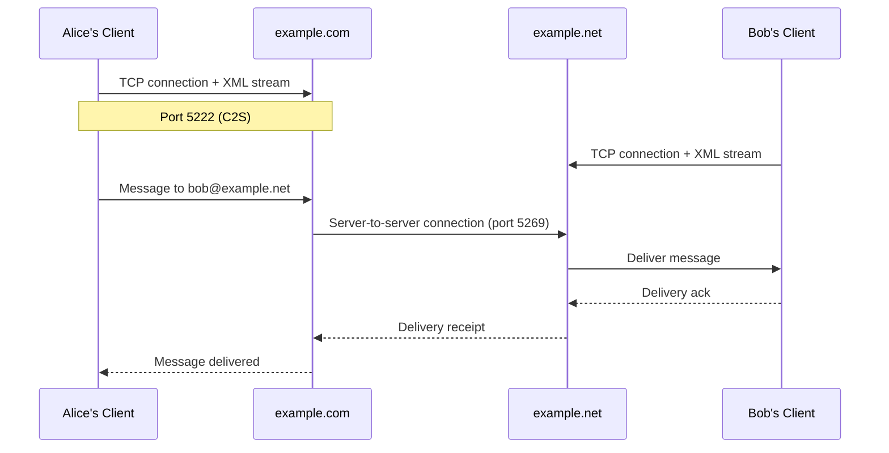
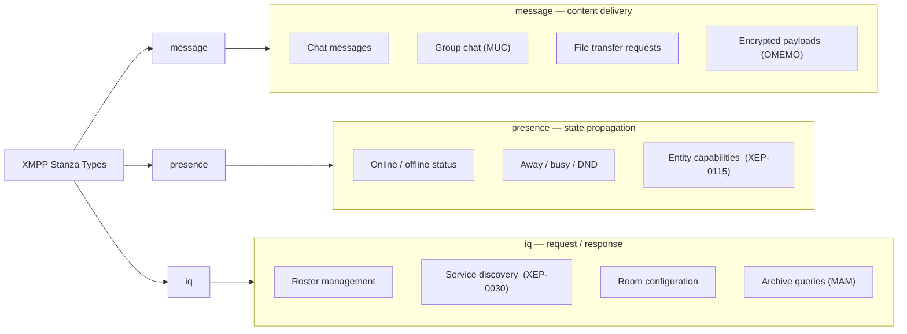
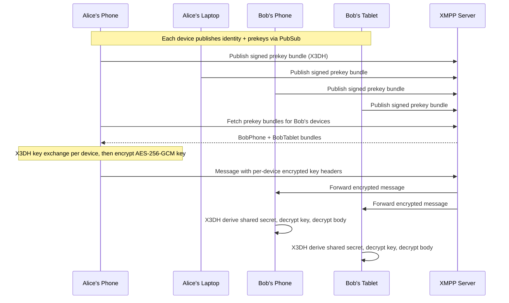

Вероятно никога не сте чували за XMPP, но има голям шанс индиректно да сте го срещнали. Google Talk беше изграден върху него. Ранната инфраструктура на WhatsApp работеше с ejabberd, един от най-широко разположените XMPP сървъри. Cisco, Nokia и десетки корпоративни доставчици пуснаха продукти, изградени изцяло върху вътрешностите на XMPP. Безброй чат системи, колаборативни платформи и инструменти за комуникация в реално време заимстваха директно от неговата архитектура през последните две десетилетия.

> **Забележка:** Тази статия е задълбочен технически преглед на това как XMPP работи на ниво протокол. Ако търсите по-леко въведение без XML и RFC, има [нетехническа версия тук](https://blog.chatrix.one/posts/XMPP-communication/), която обхваща същата тема на разбираем език.

Днес съобщенията са доминирани от заградени екосистеми. Потребител на WhatsApp не може директно да изпрати съобщение на някого в Signal. Потребител на Signal не може да чати с потребител на iMessage. Потребител на Telegram живее вътре в екосистемата на Telegram. Всяка платформа съществува като свой собствен остров, със свои акаунти, клиенти и правила. Повечето хора приемат това положение, защото приложенията са полирани, удобни и познати.

Интернет не трябваше да работи по този начин. Имейлът остава оперативно съвместим, защото е изграден върху отворени стандарти. Всеки може да управлява пощенски сървър и да комуникира с всеки друг. Мрежата работи, защото браузърите и уебсайтовете комуникират чрез общи протоколи. Съобщенията можеха да еволюират в същата посока. Вместо това, по-голямата част от индустрията избра централизация.

Почти.

Има един протокол, който упорито отказа да последва този път. Протокол, който е оцелял след възхода и падението на мрежите за незабавни съобщения, империите на социалните медии и безброй стартъп чат приложения. Този протокол е XMPP. Той е децентрализиран, отворен, търпи надграждане и е по-стар от много от разработчиците, които го използват днес. Най-важното е, че все още работи.

Двадесет и пет години след създаването му, хората продължават да надграждат върху него, да го разширяват и да го внедряват. В момента има над 3000 публично изброени XMPP сървъра, работещи по света, като оценките предполагат, че действителният брой, включващ частни внедрявания, е значително по-висок. Докато по-новите комуникационни системи идват и си отиват, XMPP остава тихо оперативен, маршрутизирайки милиарди XML строфи дневно. За да разберем защо, трябва да се върнем към началото.

## Началото: Jabber и отвореният Интернет

Историята започва през 1998 г. По това време незабавните съобщения бяха фрагментирани в няколко собственически мрежи. AOL Instant Messenger доминираше с над 50 милиона потребители, ICQ имаше приблизително 40 милиона, Yahoo! Messenger и MSN Messenger растяха бързо и всяка от тях работеше като напълно затворена екосистема. Ако приятелите ви използваха различна услуга, нямахте късмет. Нямаше междуплатформени съобщения, нямаше отворен API и нямаше интерес от страна на участващите компании да променят това.

Джереми Милър, програмист от Айова, намира тази ситуация за разочароваща. Самият Интернет беше изграден около отворени протоколи: SMTP за имейл, DNS за разрешаване на имена, HTTP за мрежата, IRC за групов чат. Съобщенията сякаш се движеха в обратната посока, към фрагментация и контрол от доставчика. Неговото решение беше проект, наречен Jabber, с проста цел: да създаде отворен протокол, който всеки да може да внедри и всеки да може да използва.

През януари 1999 г. Милър обяви проекта Jabber публично. Първата сървърна реализация, jabberd, беше пусната като софтуер с отворен код. През следващите години около протокола се формира общност, която създаде множество сървърни реализации, десетки клиенти и разрастваща се библиотека от разширения на протокола.

За разлика от всички големи системи за съобщения от онази епоха, Jabber беше проектиран от самото начало като федеративна мрежа. Можете да управлявате свой собствен сървър. Можете да създадете свой собствен клиент. Можете да комуникирате с потребители на напълно различни сървъри. Никакъв централен орган не контролираше мрежата. Идеята беше структурно идентична с имейла, но оптимизирана за комуникация в реално време с доставка на съобщения за част от секундата и семантика на постоянни връзки.

До 2002 г. протоколът беше узрял достатъчно. Именно поради това Фондацията за софтуер Jabber го представи на Интернет инженерната работна група (IETF). Същата организацията, отговорна за стандартизиране на Интернет протоколи, включително TCP, HTTP, SMTP и DNS. Резултатът беше XMPP (Extensible Messaging and Presence Protocol), разширяемият протокол за съобщения и присъствие. През 2004 г. IETF публикува първите официални спецификации като RFC 3920 (XMPP Core) и RFC 3921 (Незабавни съобщения и присъствие). По-късно те бяха преработени и заменени от RFC 6120 (XMPP Core), RFC 6121 (Незабавни съобщения и присъствие) и RFC 7622 (Формат на адрес), които остават авторитетните препратки и днес.

## XMPP не е приложение

Едно от най-важните неща, които трябва да разберете за XMPP е, че той не е приложение. Хората често го сравняват директно с WhatsApp, Signal, Telegram или Discord и това сравнение е фундаментално погрешно. XMPP е протокол, по същия начин, по който SMTP е протокол и HTTP е протокол. По-точно сравнение: SMTP се отнася към Gmail, както XMPP се отнася към Conversations. HTTP се отнася към Chrome, както XMPP се отнася към Gajim.

Протоколът определя как информацията се движи през мрежата. Приложенията реализират протокола и предоставят потребителски интерфейс. Това разграничение има огромно значение, защото променя кой контролира системата. При собственническа платформа за съобщения, една компания притежава сървърите, протокола, клиентските приложения и потребителските акаунти. Целият стек е вертикално интегриран и контролиран. При XMPP тези компоненти са напълно независими. Можете да смените клиентите, без да сменяте сървъра. Можете да смените сървъра, без да сменяте клиентите. Можете да управлявате своя собствена инфраструктура и все още да комуникирате с останалия свят. Тази гъвкавост е една от основните причини XMPP да остане жизнеспособен в продължение на двадесет и пет години.

## Федерация: Имейл за комуникация в реално време

В основата си XMPP е федеративна система. Федерация означава, че независими сървъри комуникират директно помежду си, използвайки споделен протокол, без да се нуждаят от централен орган, който да посредничи при обмена. Имейлът е най-успешният пример за федерация в мащаб: над 4 милиарда потребители на имейл в стотици хиляди независими пощенски сървъри комуникират свободно, защото споделят стандарта SMTP. XMPP следва същия архитектурен модел.

Диаграмата по-долу показва как два XMPP сървъра маршрутизират съобщение между потребители в различни домейни.



Когато alice@example.com изпрати съобщение до bob@example.net, сървърът на Алис търси DNS SRV записа за _xmpp-server._tcp.example.net, за да намери адреса на сървъра на Боб, отваря защитена с TLS TCP връзка на порт 5269, удостоверява се с помощта на Dialback (XEP-0220) или SASL EXTERNAL със сертификат и препраща строфата. Никакъв централен XMPP орган не участва в обмена. Сървърите комуникират директно, равноправно.

Ползите от тази архитектура са значителни: няма единна точка на отказ, няма задължително обвързване с доставчик, свобода да хоствате собствена инфраструктура, оперативна съвместимост между организации и дългосрочна архитектурна устойчивост. Компромисите също са реални. Спамът става по-труден за контрол, защото няма централен екип за злоупотреби. Администраторите трябва да управляват доверителните отношения с отдалечени домейни. Операторите на сървъри носят пълна отговорност за сигурността и достъпността. Това са същите компромиси, с които имейлът се справя от десетилетия, и общността на XMPP е разработила сравнително добри инструменти за управлението им.

## Разбиране на XMPP JID и адреси

Всеки XMPP потребител има Jabber ID, обикновено наричан JID. Форматът е дефиниран в RFC 7622 и се състои от максимум три части. Голият JID изглежда идентично с имейл адрес: alice@example.com. Частта alice се нарича локална част (localpart), а example.com е домейн частта (domainpart). Пълният JID добавя трети компонент, наречен ресурс: alice@example.com/laptop.

Ресурсът идентифицира конкретна клиентска сесия, а не потребителя като цяло. Един потребител може да има множество ресурси, свързани едновременно, всеки от които представлява различно устройство или клиентска инстанция. Например alice@example.com/phone, alice@example.com/laptop и alice@example.com/tablet могат да бъдат активни едновременно. Когато съобщение е адресирано до голия JID alice@example.com, сървърът прилага алгоритъм за маршрутизиране, за да реши кой ресурс да го получи, обикновено този с най-високия деклариран приоритет. Когато съобщение е насочено към пълния JID alice@example.com/phone, то се доставя конкретно на тази сесия и на никоя друга.

Този механизъм с ресурси беше отговорът на XMPP за комуникация с множество устройства през 2004 г., години преди проблемът да стане масов. Локалната част и домейн частта не са чувствителни към главни букви и трябва да отговарят на профилите Nodeprep и Nameprep на спецификацията Stringprep (RFC 3454). Ресурсите са чувствителни към главни букви и са предмет на профила Resourceprep. Тези правила съществуват, за да се предотврати двусмислие и да се гарантира последователно обработване на адреси в различните сървърни реализации.

## Присъствие: Ядрото, което прави XMPP различен

Повечето хора мислят за съобщенията като за изпращане на текст. XMPP беше проектиран около по-широка и технически по-интересна концепция: присъствие. Присъствието не е просто индикатор за онлайн състояние. Това е система за разпространение на състояние в реално време, вградена в ядрото на протокола.

Присъствието отговаря на въпроси, които повечето протоколи третират като второстепенни грижи: Този потребител онлайн ли е? Отсъства ли, зает ли е или е в среща? Кое устройство използва? Какви възможности поддържа текущият му клиент? Последният въпрос се обработва от Entity Capabilities (XEP-0115), което позволява на клиентите да представят хеш на списъка си с поддържани функции във всяка строфа за присъствие. Това означава, че всеки контакт, който получи вашата актуализация на присъствието, може незабавно да извлече точно кои XEP поддържа вашият клиент, без да издава отделна заявка за откриване.

Когато потребител се свърже, неговият клиент изпраща строфа `<presence/>`, която сървърът разпространява до всеки оторизиран контакт. След това сървърът на всеки контакт доставя актуализацията до свързаните ресурси на този контакт. Това създава базирана на абонамент публикуване/абониране графа в ядрото на всяка XMPP сесия. Сървърът поддържа тази графа на присъствие, която непрекъснато се актуализира, когато потребителите се свързват, изключват и променят състоянието си. В мащаб натоварен ejabberd клъстер, обработващ милиони потребители, може да обработва стотици хиляди строфи за присъствие в секунда. В края на 90-те години изграждането на този вид разпределена осведоменост в реално време в рамките на протоколен стандарт беше наистина новаторско.

## Как едно съобщение пътува през мрежата

За да разберете XMPP на техническо ниво, на помощ идва следната схема, която проследява точната последователност от събития, когато Алис изпрати съобщение на Боб на различен сървър.

1. Клиентът на Алис отваря TCP връзка към `example.com` на порт 5222.
2. Сървърът изпраща начален `<stream:stream>` хедър, рекламиращ наличните функции.
3. Клиентът инициира STARTTLS. Сървърът надгражда връзката до TLS 1.2 или 1.3.
4. XML потокът се рестартира през криптираната връзка.
5. Сървърът рекламира SASL механизмите. Алис се удостоверява с помощта на SCRAM-SHA-256.
6. Потокът се рестартира отново. Клиентът изпраща IQ заявка за свързване, за да заяви ресурс.
7. Установяването на сесията приключва. Клиентът на Алис изпраща строфа `<presence/>`.
8. Клиентът на Боб завършва същата последователност на example.net.
9. Алис съставя съобщение. Нейният клиент изпраща строфа `<message>`, адресирана до `bob@example.net`.
10. Сървърът на Алис анализира строфата, вижда отдалечения домейн и извършва DNS SRV търсене за `_xmpp-server._tcp.example.net`.
11. Ако не е налична съществуваща S2S връзка, `example.com` отваря нова TLS връзка към `example.net` на порт 5269 и удостоверява потока.
12. Строфата се препраща през S2S връзката.
13. `example.net` проверява строфата, търси активните ресурси на Боб и насочва съобщението към подходящата сесия.
14. Клиентът на Боб получава строфата.

Пълното двупосочно пътуване от стъпка 9 до стъпка 14 обикновено завършва за под 100 милисекунди за сървъри с добра Интернет свързаност. За разлика от HTTP, където всеки цикъл заявка-отговор включва разходи за установяване на връзка, XMPP връзките остават отворени за продължителността на сесията. Клиент, свързан в продължение на часове, изпраща хиляди строфи през една TCP връзка, като TLS договарянето се случва само веднъж в началото на сесията.

## XML потоци: Фундаментът на XMPP

Една от причините XMPP да се усеща като архитектурно необичаен за разработчици, запознати с REST или gRPC, е използването на постоянни XML потоци. Този избор често е критикуван от разработчици, които свързват XML с надут корпоративен софтуер, но в XMPP XML служи за съвсем различна цел от сериализацията на документи.

Една XMPP сесия се състои от два независими XML потока: по един във всяка посока. Всеки поток е един дългоживеещ XML документ, който започва с коренен елемент `<stream:stream>` и завършва със `</stream:stream>` само при прекъсване на връзката. Между тези тагове строфите се обменят непрекъснато в реално време. Както клиент-към-сървър, така и сървър-към-сървър връзките следват този модел, като всяка поддържа своя собствена двойка потоци.

Отварянето на сесия изглежда така:

```xml
<?xml version='1.0'?>
<stream:stream
    from="alice@example.com"
    to="example.com"
    version="1.0"
    xml:lang="en"
    xmlns="jabber:client"
    xmlns:stream="http://etherx.jabber.org/streams">
```

Сървърът отговаря със собствен хедър на потока, след което рекламира функции:

```xml
<stream:features>
  <starttls xmlns="urn:ietf:params:xml:ns:xmpp-tls">
    <required/>
  </starttls>
</stream:features>
```

След приключване на TLS договарянето и удостоверяването, потокът се рестартира и се презентират допълнителни функции, обикновено свързване на ресурс и управление на сесията. Коренният елемент `stream:stream` умишлено никога не се затваря по време на нормална работа. Той остава отворен като безкраен контейнер за строфи, докато някоя от страните не изпрати `</stream:stream>`, за да сигнализира за организирано изключване.

Този дизайн предоставя няколко практически предимства. XML именните пространства позволяват на различни разширения да споделят един и същ поток без сблъсъци. Нови типове строфи и дъщерни елементи могат да бъдат добавени без промяна на рамката на потока. Самодокументиращият се характер на XML означава, че запис на поток е четим от човека и може да се дебъгва без схема. Тези свойства позволиха на XMPP да абсорбира десетилетия еволюция на протокола, без да изисква препроектиране на формата на предаване.

## Трите строфи: ДНК-то на XMPP

Всичко, което се обменя в XMPP сесия, е кодирано като един от три типа строфи. Това не са конструкции на приложно ниво, насложени върху транспорт. Те са самият транспорт, дефиниран в основния RFC и обработван директно от всеки XMPP сървър на планетата.



### message

Строфата `<message>` пренася съдържание от един обект към друг. Тя не изисква потвърждение по подразбиране, което я прави подходяща за доставка тип "пусни и забрави". Атрибутът `type` контролира поведението на маршрутизиране: `chat` за разговори един към един, `groupchat` за MUC стаи, `headline` за автоматизирани известия, `normal` за асинхронни съобщения без контекст на разговор и `error` за докладва за неуспешна доставка.

```xml
<message
    from="alice@example.com/laptop"
    to="bob@example.net"
    type="chat"
    id="msg-001">
  <body>Hello!</body>
  <request xmlns="urn:xmpp:receipts"/>
</message>
```

Атрибутът `id` се използва за потвърждения за доставка (XEP-0184) и корекция на съобщения (XEP-0308). Разширенията прикачат функционалност чрез добавяне на дъщерни елементи в техните собствени XML пространства от имена, без да променят основната структура на строфата.

### presence

Строфата `<presence>` съобщава за наличност и състояние. Гола `<presence/>` без атрибути сигнализира, че потребителят е онлайн и наличен. Атрибутът `type` управлява модела на абониране и наличност: `unavailable` сигнализира за изключване, `subscribe` заявява абонамент за присъствие, `subscribed` го предоставя, `unsubscribe` и `unsubscribed` управляват премахването. Дъщерните елементи за статус и приоритет позволяват фино настроен контрол:

```xml
<presence>
  <show>away</show>
  <status>In a meeting until 3pm</status>
  <priority>10</priority>
  <c xmlns="http://jabber.org/protocol/caps"
     hash="sha-1"
     node="https://gajim.org"
     ver="QgayPKawpkPSDYmwT/WM94uAlu0="/>
</presence>
```

Елементът `c` е хешът на Entity Capabilities от XEP-0115. Всеки клиент, който получи тази строфа за присъствие, може да изчисли SHA-1 хеша на списъка с функции на подателя и да го сравни с локален кеш, избягвайки пълно заобикаляне при откриване на услуги.

### iq

IQ означава Info/Query (Информация/Заявка). Тези строфи реализират синхронен модел заявка-отговор, функционирайки като леки отдалечени процедурни извиквания през XML потока. Всяка IQ заявка трябва да получи точно един IQ отговор. Атрибутът `type` има четири стойности: `get` (заявка), `set` (запис), `result` (успешен отговор) и `error` (отговор за грешка).

Извличане на списък с контакти изглежда така:

```xml
<!-- Request -->
<iq type="get" id="roster1" from="alice@example.com/laptop">
  <query xmlns="jabber:iq:roster"/>
</iq>

<!-- Response -->
<iq type="result" id="roster1" to="alice@example.com/laptop">
  <query xmlns="jabber:iq:roster" ver="ver14">
    <item jid="bob@example.net" name="Bob" subscription="both">
      <group>Friends</group>
    </item>
  </query>
</iq>
```

Атрибутът `id` свързва заявки и отговори, когато множество IQ обмени са едновременно в ход, което е често срещано по време на инициализация на сесията, когато клиентът издава паралелни заявки за откриване на услуги, списък с контакти и отметки.

## Силата на XEP: Как XMPP се развива, без да се саморазруши

Повечето протоколи остаряват, защото не могат да се адаптират адекватно. Интернет е осеян с технологии, които добре решават даден проблем, но попадат в капан от собствения си дизайн, когато изискванията се променят. XMPP избегна тази съдба чрез умишлен архитектурен принцип, поддържайки основния протокол малък и стабилен и прехвърляйки цялата нова функционалност в независими разширения.

Тези разширения се наричат XMPP Extension Protocols или XEP. Те се публикуват, поддържат и развиват чрез процес на стандартизация, управляван от XMPP Standards Foundation (XSF), организация с нестопанска цел, основана през 2001 г. Към 2026 г. има над 450 публикувани XEP, обхващащи теми от основно прехвърляне на файлове до телеметрия от IoT устройства, социални мрежи, игри в реално време и автоматизация на корпоративни работни потоци. Всеки XEP преминава през жизнен цикъл: Експериментален, Предложен, Чернова, Окончателен и потенциално Оттеглен или Остарял. Този поетапен процес означава, че реализациите имат стабилни цели, към които да се стремят, и че общността може да оттегли остарели разширения, без да наруши ядрото.

Мислете за RFC като за ядрото. XEP са потребителското пространство. Ядрото определя как строфите се маршрутизират, потоците се отварят и удостоверяването работи. Всичко останало живее в разширения. Не всеки сървър или клиент реализира всеки XEP и това е по дизайн. Минимален вграден IoT клиент може да реализира само основния RFC плюс XEP-0199 (ping) и XEP-0060 (PubSub). Пълнофункционален десктоп клиент като Gajim реализира над 50 XEP. И двете са валидни XMPP реализации. И двете си взаимодействат на ниво маршрутизиране на строфи, независимо от съответните им функционални възможности.

## Откриване на услуги: Разширението, което прави разширенията да работят

Ако всеки клиент трябваше да "hardcode"-ва кои функции поддържа всеки сървър, екосистемата XEP би се срутила от собствената си тежест преди години. Механизмът, който предотвратява това, е XEP-0030, Service Discovery (Откриване на услуги), универсално наричан Disco.

Disco дефинира две подзаявки. Заявката `disco#info` пита даден обект какви функции и идентичности поддържа. Заявката `disco#items` пита какви дъщерни възли или услуги излага. Клиент, свързващ се с нов сървър за първи път, издава заявка `disco#info` към домейн JID на сървъра:


```xml
<iq type="get" to="example.com" id="disco1">
  <query xmlns="http://jabber.org/protocol/disco#info"/>
</iq>
```

Сървърът отговаря със списък от низове за функции, всеки от които съответства на именни пространства, дефинирани в XEP:

```xml
<iq type="result" from="example.com" id="disco1">
  <query xmlns="http://jabber.org/protocol/disco#info">
    <identity category="server" type="im" name="ejabberd"/>
    <feature var="urn:xmpp:mam:2"/>
    <feature var="urn:xmpp:push:0"/>
    <feature var="vcard-temp"/>
    <feature var="http://jabber.org/protocol/disco#info"/>
    <feature var="urn:xmpp:carbons:2"/>
  </query>
</iq>
```

Сега клиентът знае точно кои XEP са налични и може съответно да активира или деактивира функции. Заявката `disco#items` се използва за изброяване на дъщерни услуги. Сървър може да изложи конферентен компонент на `conference.example.com`, `pubsub` услуга на `pubsub.example.com` и услуга за качване на файлове на `upload.example.com`. Disco е директорията, която свързва всичко това. Без нея договарянето на разширения би изисквало координация out-of-band между администратори и разработчици. С нея клиентите се адаптират автоматично по време на изпълнение.

## Списъкът с контакти: Повече от обикновен адресен списък

Всяка платформа за съобщения се нуждае от управление на контакти. В XMPP това се нарича roster (списък с контакти) и е по-сложен от обикновен адресен списък. Списъкът се съхранява на сървъра и се синхронизира с всички свързани клиенти чрез IQ строфи. Той съдържа JID на всеки контакт, четим от човека текст, незадължителна група и, което е от решаващо значение, състояние на абонамент.

Състоянието на абонамент проследява взаимната връзка за споделяне на присъствие между двама потребители. Има четири възможни стойности: `none` (без споделяне на присъствие), `from` (контактът споделя присъствие с вас), `to` (вие споделяте присъствие с контакта) и `both` (взаимно споделяне на присъствие). Този модел дава на потребителите изричен контрол върху това кой може да вижда онлайн статуса им, за разлика от повечето съвременни приложения за съобщения, където споделянето на присъствие е двоично и често автоматично.

Когато Алис добави Боб като контакт, тя изпраща строфа `<presence type="subscribe"/>` към неговия JID. Боб получава заявка за абонамент и може или да я одобри с `<presence type="subscribed"/>`, или да откаже с `<presence type="unsubscribed"/>`. Едва след като Боб одобри, сървърът на Алис започва да доставя неговите актуализации на присъствието. Този формален модел на абонамент предхожда и предвижда концепцията за последващи заявки/приятели, която става стандарт в социалните мрежи години по-късно.

## Многопотребителски чат: Групови съобщения, преди груповите съобщения да бяха страхотни

XEP-0045, Multi-User Chat (MUC), е едно от най-старите и най-често внедрявани разширения на XMPP. Публикувано е през 2002 г., три години преди Slack да съществува като концепция и десетилетие преди корпоративните групови съобщения да станат масова категория. MUC стая е постоянна, хоствана от сървър чат стая с пълен модел за контрол на достъпа.

Всяка стая има "гол" JID, идентифициращ услугата на стаята и името на стаята: `developers@conference.example.org`. Потребителите се присъединяват, като изпращат насочено присъствие към пълен JID, който включва техния избран псевдоним: `developers@conference.example.org/alice`. След това стаята отразява съобщения до всички обитатели, използвайки типа съобщение `groupchat`.

MUC стаите поддържат четиристепенна система от роли и принадлежности. Принадлежностите са постоянни: собственик (пълен административен контрол), администратор (може да забранява и изключва), член (допуска се в стаи само за членове) и изгонен (забранен). Ролите са с обхват на сесията: модератор, участник и посетител. Тази фина система за разрешения позволява на XMPP да хоства структурирани общности с правилно управление години преди Discord и Slack да популяризират концепцията. Протоколът продължава да се развива в тази област; XEP-0402 предоставя подобрено управление на отметки на стаи със сървърна синхронизация, а MUC Sub (XEP-0369) въвежда базиран на абонамент групов чат като алтернатива на традиционния модел на обитатели.

## PubSub: Най-подценяваната част от XMPP

Повечето хора свързват XMPP с директни съобщения. XEP-0060, Publish-Subscribe (PubSub), разкрива съвсем различно измерение на протокола. PubSub трансформира XMPP от система за съобщения точка-до-точка в платформа за разпространение на събития в реално време с формален модел на абонамент.

Архитектурата е проста. Услугата PubSub хоства дърво от възли. Публикуващите изпращат елементи към възли. Абонатите получават тези елементи автоматично без заявки. Публикуващият няма познание за това кой е абонатът. Той просто записва във възела и услугата се грижи за разпространяването. Това разединяване е архитектурно идентично с модела на брокер, използван от Apache Kafka, MQTT и AMQP, с изключение на това, че XMPP PubSub доставя събития чрез същия удостоверен, федеративен поток, който пренася чат съобщения.

Практически внедрявания са използвали XMPP PubSub за SCADA телеметрия (инициативата XMPP-IoT), проследяване на местоположение в системи за управление на автопаркове, емисии на социални дейности (оригиналният дизайн на вече несъществуващата социална мрежа Buddycloud беше изграден изцяло върху XMPP PubSub), канали за оперативно наблюдение и контролни равнища на софтуерно дефинирани мрежи. XSF публикува XEP-0235 и свързани IoT разширения именно защото XMPP PubSub е естествено подходящ за мащабна телеметрия от устройства към облак - удостоверен, федеративен, в реално време и базиран на стандарти.

## Jingle: Трансфер на глас, видео и файлове

XEP-0166, Jingle, е отговорът на XMPP на проблема с установяването на медийни сесии в реално време между клиенти. Той не е протокол за пренос на медии. Той е рамка за сигнализация. Неговата задача е да договаря параметрите на директна връзка между две крайни точки, след което медийните потоци преминават от тип „peer-to-peer“ извън XMPP потока изцяло.

Jingle използва ICE (Interactive Connectivity Establishment, RFC 8445) за NAT traversal, което е абсолютно същият механизъм, който използва WebRTC. Това не е съвпадение: авторите на спецификацията WebRTC са черпили директно от опита на Jingle и свързаната с него работа на IETF. ICE работи, като събира кандидати за адреси от множество източници - локалния мрежов интерфейс, STUN сървър и по избор TURN реле. Кандидатите се обменят чрез XMPP сигнални строфи и ICE извършва проверки за свързаност, за да намери работещ път. На практика директните peer-to-peer връзки са успешни в приблизително 80-85% от случаите в типичните мрежи. Останалите случаи се връщат към TURN реле.

Самите медийни данни се пренасят по RTP (RFC 3550), като договарянето на кодеци се обработва чрез SDP offer/answer, вграден в Jingle строфи (XEP-0167 за аудио, XEP-0180 за видео). Резултатът е цялостна, базирана на стандарти, peer-to-peer мултимедийна сигнализационна система, която предшества WebRTC с няколко години и е повлияла на нейния дизайн.

## Съвременните съобщения изискват синхронизация

През 2004 г. повечето потребители имаха едно устройство. През 2026 г. средният собственик на смартфон притежава и лаптоп, а много имат и таблет и работна станция. Всяко изпратено съобщение трябва да се появи на всички тях. XMPP адресира многопотребителската синхронизация чрез две взаимно допълващи се разширения, които работят заедно.

### Управление на архива на съобщения

XEP-0313, Message Archive Management (MAM), дефинира съхраняване на съобщения от страна на сървъра с интерфейс за структурирани заявки. Когато MAM е активиран, сървърът архивира всяка строфа, преминаваща през него. Клиент, който е бил офлайн шест часа, или новоинсталиран клиент на ново устройство, издава MAM заявка с филтър за времеви печат, за да извлече всичко, което е пропуснал:

```xml
<iq type="set" id="mam1">
  <query xmlns="urn:xmpp:mam:2" queryid="q1">
    <x xmlns="jabber:x:data" type="submit">
      <field var="FORM_TYPE" type="hidden">
        <value>urn:xmpp:mam:2</value>
      </field>
      <field var="start">
        <value>2026-06-12T08:00:00Z</value>
      </field>
    </x>
  </query>
</iq>
```

Сървърът предава архивирани строфи обратно като препратени съобщения, всяко от които е увито с оригиналния си времеви печат. MAM поддържа пълнотекстово търсене на сървъри, които го реализират, RSM (Result Set Management, XEP-0059) за странирано извличане и филтриране по JID или времеви диапазон. Без MAM всяко устройство поддържа изолирана локална история без начин за синхронизиране. С MAM историята на разговорите става сървърен ресурс, който всеки удостоверен клиент може да заявява.

### Копия на съобщения

XEP-0280, Message Carbons, обработва частта в реално време от проблема със синхронизацията. Когато клиент се включи, като изпрати IQ разрешаваща строфа, сървърът копира всяко изходящо и входящо съобщение за този акаунт към всички други свързани ресурси едновременно. Ако Алис изпрати съобщение от телефона си, нейният лаптоп получава копие за милисекунди. Това поддържа всички активни сесии последователни в реално време, без да изисква клиентите да заявяват или да питат MAM за скорошни съобщения. MAM и Carbons работят в тандем. Carbons обработва жива синхронизация за свързани устройства, MAM обработва с цел наваксване за офлайн или новосвързани такива.

## Управление на потоци: Оцеляване при лоша свързаност

Мобилните мрежи постоянно прекъсват връзките. Потребител, който се мести между Wi-Fi и клетъчна мрежа, влиза в асансьор или просто заключва екрана си, може да доведе до прекратяване на основната TCP връзка, без нито една от страните да е наясно незабавно. Без механизъм за възстановяване, резултатът е тиха загуба на съобщения и десинхронизирано състояние.

XEP-0198, Управление на потоци, решава това с лек протокол за потвърждение и възобновяване, разположен върху XML потока. След активиране на Управлението на потоци, както клиентът, така и сървърът поддържат брояч на получените строфи. Клиентът периодично изпраща строфи `<a h="N"/>`, потвърждаващи получаването на N строфи от сървъра, а сървърът прави същото в обратната посока. Във всеки един момент всяка от страните може да изпрати `<r/>`, за да поиска незабавно потвърждение.

Когато връзката се прекъсне, клиентът се свързва отново и изпраща строфа `<resume/>`, съдържаща последния брояч на потвърждения и токен за сесия, издаден по време на първоначалното установяване на сесията. Сървърът проверява изходящата си опашка, идентифицира кои строфи не са били потвърдени и предава отново само тях. Сесията се възобновява точно оттам, откъдето е прекъсната, с гарантирана семантика на доставка, еквивалентна на TCP, но работеща на ниво XMPP строфи, а не на ниво байт. При тестване в мобилни мрежи с висока латентност, Stream Management намалява процента на загуба на съобщения до почти нула, дори при лоши условия. Също така значително намалява разходите за повторно свързване. Възобновената сесия избягва пълно TLS договаряне и SASL удостоверяване, намалявайки времето за повторно свързване от няколко секунди до под 200 милисекунди при типични мобилни връзки.

## Push известия и мобилната реалност

Една валидна критика към XMPP на мобилни платформи исторически е била консумацията на батерия. Поддържането на постоянна TCP връзка на смартфон изисква поддържане на радиото активно, което изтощава батерията. iOS и Android имат ограничения за фонови процеси, които затрудняват поддържането на продължителни връзки.

Съвременните XMPP внедрявания адресират това чрез XEP-0357, Push Notifications. Механизмът работи по следния начин: мобилният клиент регистрира push крайна точка с XMPP сървъра (обикновено Apple APNs или Google FCM токен, маршрутизиран чрез междинен сървър на приложение). Когато пристигне съобщение за потребителя и не съществува активна XMPP връзка, сървърът изпраща push известие чрез вградената push инфраструктура на платформата, за да събуди клиента. След това клиентът възстановява своята XMPP връзка, извлича съобщението чрез MAM или Carbons и го представя на потребителя.

Този подход добавя латентност от около една до три секунди в сравнение с постоянна връзка, но намалява консумацията на батерия във фон до нива, сравними с имейл клиентите. Приложения като Conversations за Android и Monal за iOS са валидирали този подход в продукция, демонстрирайки, че използването на батерията от XMPP на съвременни смартфони е повече от приемливо за типични работни натоварвания. Твърдението, че XMPP е неефективен по отношение на батерията на мобилни устройства, отразява състоянието на екосистемата около 2012 г., но не и през 2026 г.

## Сигурност: Основата е важна

Сигурността в комуникационния протокол не е единична функция. Тя е набор от механизми, адресиращи различни модели на заплахи на различни слоеве. Архитектурата за сигурност на XMPP адресира поверителността на транспорта, целостта на удостоверяването, криптирането от край до край и секретността напред независимо, което позволява всеки слой да бъде оценен и надграден, без да се нарушават останалите.

## TLS: Защита на данни при пренос

Всяко производствено внедряване на XMPP криптира транспорта, използвайки TLS. Връзките клиент-сървър на порт 5222 започват некриптирани и се надграждат чрез STARTTLS (RFC 3207, адаптиран за XMPP в RFC 6120). Връзките сървър-сървър на порт 5269 следват същия модел. Съществува и директен TLS порт (5223 за C2S), където TLS ръкостискането се случва веднага при свързване, което избягва STARTTLS договарянето.

Съвременните XMPP сървъри изискват TLS 1.2 като минимум, като се предпочита TLS 1.3. Документът „Съображения за сигурност“ на Фондацията за стандарти на XMPP препоръчва конфигурации на шифровани пакети, които дават приоритет на AEAD шифрите (AES-GCM, ChaCha20-Poly1305) и обмена на секретни ключове напред (ECDHE). Валидирането на сертификата е задължително. Проверката за съответствие „xmpp.net“ публично тества сървърите и ги оценява по качество на TLS конфигурацията, а по-голямата част от добре поддържаните публични сървъри постигат оценки A или A+.

## SASL: Правилно извършено удостоверяване

Удостоверяването в XMPP се обработва чрез SASL, Simple Authentication and Security Layer (RFC 4422). SASL дефинира слой на абстракция, който разделя механизма за удостоверяване от протокола, който го използва, позволявайки на XMPP да поддържа множество методи за удостоверяване, без да вгражда специфичен обмен на идентификационни данни в основната спецификация.

Механизмите, налични в типично внедряване, са: SCRAM-SHA-256 и SCRAM-SHA-1 (Salted Challenge Response Authentication Mechanism, RFC 5802), които доказват познаване на парола чрез криптографски обмен на предизвикателство-отговор, без да се предава паролата или обратим хеш; PLAIN, който предава паролата в base64 и е приемлив само през TLS-защитена връзка; и EXTERNAL, който използва клиентски сертификат за удостоверяване и е стандартният подход за удостоверяване от сървър към сървър, когато е конфигуриран взаимният TLS. SCRAM-SHA-256 е настоящият препоръчителен механизъм за удостоверяване на клиенти, базирано на парола. Той осигурява взаимно удостоверяване (клиентът също така проверява самоличността на сървъра по време на обмена), което предпазва от кражба на идентификационни данни в случай на DNS spoofing или неправилно издаване на сертификат.

## OMEMO: Модерно криптиране от край до край

Транспортното криптиране защитава данните по време на пренос, но не защитава съобщенията от оператора на сървъра или от всеки, който има достъп до сървъра. Криптирането от край до край гарантира, че криптираният текст е единственото нещо, което сървърът вижда. Настоящият стандарт за E2EE в XMPP е OMEMO, дефиниран в XEP-0384.

OMEMO е изграден върху два криптографски примитива от Signal Protocol. X3DH (Extended Triple Diffie-Hellman) се използва за първоначално установяване на ключ: всяко устройство публикува набор от публични ключове към сървъра (ключ за идентичност, подписан предварителен ключ и пакет от еднократни предварителни ключове). Когато подателят иска да инициира криптирана сесия с устройството на получателя, той извлича публичните ключове на получателя и извършва X3DH обмен, за да извлече споделена тайна без никакво взаимодействие. След това алгоритъмът Double Ratchet управлява текущата сесия. Тка наречената "Двойната тресчотка" поддържа две отделни тресчотки: тресчотка на Дифи-Хелман, която периодично генерира нов ключов материал, и хеш тресчотка, която извлича ключове за всяко съобщение. Резултатът е секретност напред (компрометирането на текущи ключове не разкрива минали съобщения) и възстановяване след взлом (компрометирането на ключ не разкрива бъдещи съобщения след следващата стъпка на DH тресчотката).

OMEMO обработва множество устройства директно чрез криптиране на отделно копие на симетричния ключ на съобщението за всяко от устройствата на получателя, както и за всяко от собствените устройства на изпращача за съвместимост с Carbons. Действителното съдържание на съобщението се криптира веднъж с AES-256-GCM. Само 32-байтовият AES ключ се криптира за всяко устройство с извлечената от X3DH тайна. Това означава, че добавянето на повече устройства има линейна цена в ключовите операции, но незначителна цена в размера на шифрования текст.



Когато OMEMO е активен, XMPP сървърът вижда само JID на подателя, JID на получателя, времеви печат и непрозрачен криптиран масив от данни (blob). Съдържанието на съобщението, прикачените файлове и реакциите са неразличим шифрован текст от гледна точка на сървъра.

## Преди OMEMO: Кратка история на XMPP криптирането

Крайното криптиране в XMPP не е започнало с OMEMO. Екосистемата е преминала през три различни подхода в продължение на две десетилетия, всеки от които е решил проблемите, оставени от предшественика си.

Първият е OpenPGP, специфициран в XEP-0027. Той е работил чрез подписване и криптиране на телата на съобщенията, използвайки стандартни PGP ключове, които потребителите са обменяли и управлявали ръчно. За технически напреднали потребители, вече вградени в PGP екосистемата, това е било естествено решение. Проблемите обаче са били значителни: липса на предварителна секретност (компрометиране на дългосрочен частен ключ, разкриващ всяко минало съобщение, криптирано към него), липса на поддръжка на множество устройства, сложно управление на ключове и зависимост от модел на мрежа от доверие, който повечето потребители са намирали за непрактичен. XEP-0027 вече е официално отхвърлен. Неговият наследник, XEP-0373 и XEP-0374 (наричани общо OpenPGP за XMPP или OX), модернизира подхода с по-добра обработка на ключове и поддържа криптиране не само на телата на съобщенията, но и на строфите за присъствие и полезните товари на PubSub, които OMEMO не покрива. OX остава технически активен и има нишова употреба в автоматизирани системи и сценарии за криптиране от сървър към сървър, но никога не е получил смислено приложение в потребителските клиенти.

Вторият подход беше OTR, Off-the-Record Messaging (Съобщения извън записа), публикуван в статията от 2004 г. „Off-the-Record Communication, или защо да не използваме PGP“ от Борисов, Голдбърг и Брюър. Заглавието беше пряка препратка към недостатъците на OpenPGP. OTR въведе две идеи, които бяха наистина нови по онова време: директна секретност чрез ефимерен обмен на ключове Diffie-Hellman (всяка сесия генерираше нова двойка DH ключове, така че компрометирането на дългосрочни ключове не разкриваше минали сесии) и криптографска отричаемост чрез публикуване на MAC ключове (в края на сесията OTR публикуваше MAC ключовете, използвани по време на сесията, което означаваше, че всеки можеше да фалшифицира преписите на съобщенията, правейки ги недопустими като криптографско доказателство за авторство).

Основното ограничение на OTR беше допускането за една-единствена активна сесия между две страни. DH тресчотката на протокола беше проектирана за две крайни точки, синхронизиращи се през една връзка. Добавянето на второ устройство означаваше провеждане на напълно отделна OTR сесия с несъвместимо състояние. Съобщение, изпратено от лаптопа на Алис, би било нечетливо на телефона на Алис, защото телефонът никога не е участвал в тази OTR сесия. Тъй като използването на множество устройства стана норма, това ограничение направи OTR все по-непрактичен.

OMEMO замени и двете, като направи многоустройствения E2EE първокласно изискване за дизайн от самото начало, комбинирайки предварителната секретност, въведена от OTR, с модела за разпределение на ключове, необходим за поддръжка на множество едновременни сесии на устройства.

### Проблемът с метаданните

Крайно криптирането решава проблема с поверителността на съдържанието. То не решава метаданните. Дори с активен OMEMO, операторът на сървър може да наблюдава кои JID комуникират, по кое време, с каква честота, от кои IP адреси и с кои отдалечени домейни. В правен контекст, само метаданните могат да бъдат много чувствителни: знанието, че JID на журналист е комуникирал с JID на конкретен източник на определени дати, може да бъде толкова разкриващо, колкото и самото съдържание на съобщението.

Това не е слабост, уникална за XMPP. Signal събира телефонни номера, времеви марки за регистрация и датата на последната връзка. WhatsApp споделя метаданни с Meta. Имейл сървърите регистрират подателя, получателя, времевите марки и IP адресите за всяко съобщение. Основният проблем е, че маршрутизирането изисква информация за адресиране, а информацията за адресиране е метаданни. Изследванията на метаданните и частните съобщения (Tor, смесени мрежи, извличане на частна информация) показват, че истинската поверителност на метаданните е свързана със значителни разходи за латентност и честотна лента, което я прави непрактична за съобщения в реално време в голям мащаб. Предложения като XMPP върху Tor са технически възможни, но остават нишови.

## Сигурността не е автоматична

Един протокол може да определи перфектна семантика за сигурност, а лошо администрираното внедряване все още може да бъде несигурно. Това важи за всеки протокол. XMPP сървър, работещ с остаряла версия с неактуализирани CVE, използващ самоподписан сертификат, който клиентите приемат без валидиране, с акаунти, защитени със слаби пароли и без ограничение на честотата на опитите за удостоверяване, не е сигурна система, независимо от това какво казва RFC.

XMPP общността адресира това отчасти чрез проверката за съответствие `xmpp.net` и документа XSF Security Considerations, и отчасти чрез инструменти като ръководство за интеграция на Certbot и конфигурации fail2ban, които администраторите на сървъри могат да прилагат. Протоколът предоставя правилните примитиви. Качеството на внедряването определя дали тези примитиви действително защитават някого.

## Проблемът със съответствието

Тъй като XMPP е протокол със стотици опционални разширения, клиент, внедряващ XEP от 2008 г., и сървър, внедряващ XEP от 2020 г., може да не успеят да взаимодействат по функции, които и двата уж поддържат. Фондацията за стандарти на XMPP разглежда това чрез годишни пакети за съответствие, понастоящем дефинирани в XEP-0459.

Пакетът за съответствие от 2024 г. определя три нива: Основно (минималната жизнеспособна имплементация на XMPP, обхващаща основни съобщения, TLS, SASL, откриване на услуги и възможности за обекти), Разширено (добавяне на MAM, Carbons, управление на потоци, push известия, качване на HTTP файлове и OMEMO) и незавършено A/V ниво, обхващащо Jingle глас и видео. Клиент или сървър може да претендира за съответствие с конкретно ниво, а потребителите могат да използват тези твърдения, за да оценят дали две имплементации ще взаимодействат по функциите, които ги интересуват. Пакетът за съответствие не елиминира всички проблеми, свързани с оперативната съвместимост, но значително стеснява повърхността на несъвместимост за масови случаи на употреба.

## Екосистемата: Сървъри, клиенти и хората, които поддържат XMPP жив

Протоколите не оцеляват само благодарение на техническите си качества. Те оцеляват, защото хората изграждат софтуер, управляват сървъри, пишат документация и продължават да допринасят. XMPP поддържа функционална екосистема повече от две десетилетия, което е рядкост за който и да е отворен стандарт.

## Основните сървъри

Няма единна официална имплементация на XMPP сървър и това е сила. Различните имплементации отразяват различни приоритети на дизайна и операторите избират въз основа на своите изисквания.

### ejabberd

ejabberd е най-широко разпространеният производствен XMPP сървър. Първоначално издаден през 2002 г. от Алексей Шчепин и написан на Erlang/OTP, той е проектиран изрично за изискванията за отказоустойчивост и паралелизъм на телекомуникационните системи. Актьорският модел на Erlang се съпоставя естествено с XMPP: всяка свързана потребителска сесия е лек Erlang процес, а дървото за надзор на OTP гарантира, че срината на сесията никога няма да свали сървъра. Клъстерите на ejabberd могат да се мащабират хоризонтално върху множество възли, използвайки Mnesia или външен бекенд за база данни. Публикувани бенчмаркове от ProcessOne (компанията, стояща зад ejabberd) демонстрират обработка на над два милиона едновременни връзки на един добре настроен възел и клъстерни внедрявания в по-голям мащаб. WhatsApp изпълни силно модифицирана версия на ejabberd, преди да пренапише инфраструктурата си за съобщения на Erlang от нулата. Софтуерът е зрял, активно поддържан и доминиращ избор за внедрявания с висок трафик.

### Prosody

Prosody, написан на Lua, е насочен към противоположния край на скалата. Минималната инсталация на Prosody може да работи удобно на сървър с 512 MB RAM и да обработва стотици едновременни потребители без настройка на конфигурацията. Модулната му система е изчистена и добре документирана, което прави лесно добавянето или премахването на функционалност. Prosody е най-често срещаната препоръка за лични или малки организационни внедрявания и най-популярната отправна точка за администратори, които са нови в самостоятелното хостване на XMPP.

### Openfire

Openfire е базиран на Java сървър от Ignite Realtime, фокусиран върху корпоративни внедрявания с административен потребителски интерфейс. Уеб-базираната му конзола за управление го прави достъпен за организации, които се нуждаят от централизиран контрол без задълбочен опит с командния ред. Той има голяма екосистема от плъгини и остава популярен в образователните институции и бизнеса.

### MongooseIM

MongooseIM, поддържан от Erlang Solutions, споделя архитектурни корени с ejabberd, но се е отклонил значително във фокуса си върху мобилно оптимизирана инфраструктура от операторски клас. Той включва вградена поддръжка за показатели, проследяване и модели на хоризонтално мащабиране, подходящи за телекомуникационни и корпоративни внедрявания в много голям мащаб.

## Клиентската екосистема

Разделянето между протокол и приложение означава, че потребителите могат да избират своя клиент независимо от своя сървър. Диапазонът от налични клиенти отразява разнообразието на екосистемата XMPP във всяка основна платформа.

### Gajim

Gajim е най-функционалният десктоп клиент, който поддържа пълния пакет за съответствие с XEP-0459, включително OMEMO, MAM, Carbons, MUC и Jingle A/V. Той работи на Linux, Windows и macOS и е референтният клиент за потребители, които искат достъп до пълната повърхност на протокола. За администратори и опитни потребители, които искат да проверяват строфи, да тестват функции на сървъра или да управляват множество акаунти с прецизен контрол, Gajim обикновено е първата препоръка.

### Conversations

Conversations за Android е широко признат за най-добрия мобилен XMPP клиент и демонстрира, че клиент с отворен протокол може да се сравни с потребителското изживяване на търговските приложения за съобщения. Той автоматично обработва OMEMO договарянето, поддържа качване на HTTP файлове, push известия и MAM веднага след инсталирането си и е основният двигател на подобренията в използваемостта на мобилните устройства в екосистемата на XMPP през последното десетилетие.

### Dino

Dino е най-чистата опция за десктоп за потребители на Linux, които намират гъстотата на функциите на Gajim за непосилна. Написан на Vala и изграден върху GTK4, той следва принципите на дизайна на GNOME и се интегрира естествено в съвременните Linux десктопи. Поддържа OMEMO, MAM, Carbons, MUC и Jingle A/V, като същевременно запазва интерфейса подреден. За потребители, които искат модерно изживяване при съобщения, без да разкриват вътрешните протоколи, Dino постига правилния баланс.

### Profanity

Profanity заемат съвсем различен ъгъл на екосистемата. Това е терминален XMPP клиент, вдъхновен от irssi, предназначен за потребители, които работят в командния ред. Въпреки минималистичния си интерфейс, той поддържа OMEMO криптиране, MUC, MAM и система от плъгини, написана на Python, Lua, Ruby или C. За сървърните администратори и разработчици, които прекарват по-голямата част от ежедневието в SSH сесии, Profanity означава, че никога няма да се налага да напускат терминала, за да изпратят криптирано съобщение.

### Converse.js

Converse.js е пълнофункционален XMPP клиент, който работи изцяло в браузъра. Той е написан на JavaScript и може да бъде вграден директно във всяка уеб страница, което го прави стандартен избор за организации, които искат да предложат XMPP достъп, без да е необходимо потребителите да инсталират каквото и да било. Той поддържа OMEMO, MUC, MAM и Carbons и може да се свърже с всеки съвместим XMPP сървър чрез WebSocket или BOSH. Много самостоятелно хоствани XMPP внедрявания използват Converse.js като лек уеб интерфейс, наред с оригинални настолни и мобилни клиенти.

### Monal

Monal предлага добре поддържан XMPP клиент за iOS и macOS с пълна поддръжка на OMEMO и модерно XEP покритие. Той е основното средство за осигуряване на достъпност на XMPP за потребителите на платформата на Apple и се е подобрил значително през последните години по отношение на надеждността и паритета на функциите с Android аналозите.

### Quicksy

Quicksy се справя с проблемите при внедряването на XMPP, като използва регистрация въз основа на телефонен номер и откриване на контакти, като същевременно остава напълно съвместим с по-широката XMPP федерация. Той е изграден върху същата кодова база като Conversations и е насочен към потребители, които искат предимствата на федерален отворен протокол без сложността при настройката на акаунт, която исторически е обезкуражавала нетехническите потребители.

### Fluux Messenger

Fluux Messenger е най-новото допълнение към клиентския пейзаж на XMPP и едно от най-интересните последни разработки в екосистемата. Стартиран е през декември 2025 г. от Микаел Ремон, основател и главен изпълнителен директор на ProcessOne, компанията, стояща зад ejabberd, по време на коледна сесия за кодиране, след като предпочитаният от него клиент се е счупил в клона, който е използвал. Това, което започна като личен проект през уикенда, се превърна в пълноценно корпоративно усилие до януари 2026 г., когато екипът му видя резултата.

Изграден с TypeScript, React и Tauri, Fluux Messenger работи като настолно приложение на Windows, macOS и Linux, а също така работи и като уеб приложение. Текущата версия имплементира над 40 XEP-а, включително MAM, MUC със споменавания и отметки, качване на HTTP файлове, въглеродни съобщения и реакции. Доставя се с вградена XMPP конзола за разработчици, локално кеширане на съобщения чрез IndexedDB с автоматична синхронизация при повторно свързване, светли и тъмни теми и поддръжка на 8 езика.

Това, което го прави архитектурно интересен, е Fluux SDK, който се намира под него. Вместо да излага сурови XML строфи на потребителския интерфейс (UI), SDK предоставя типизиран TypeScript API с реактивно управление на състоянието. Клиентът сигнализира за намерение на SDK (например, че потребителят е станал неактивен), а SDK обработва детайлите на протокола. Този трислоен дизайн (сървър, headless SDK, UI) отразява същата инженерна философия, която ProcessOne прилага към ejabberd от страна на сървъра.

Fluux Messenger е с отворен код под AGPL-3.0 и се свързва с всеки стандартен XMPP сървър. Пътната карта включва мобилна поддръжка чрез PWA и евентуално нативни приложения за Android и iOS. За проект, който започна като празничен експеримент, той се развива бързо. Като се има предвид, че ProcessOne е гръбнакът на XMPP сървърната инфраструктура повече от две десетилетия, сериозното инвестиране от тяхна страна в клиентската част е значим сигнал за екосистемата.

## Федерацията на практика

Федерацията разпределя властта, вместо да я централизира, което е едновременно нейната основна ценност и оперативна сложност. Всяка федеративна мрежа е изправена пред едни и същи предизвикателства: спам, злоупотреба, тормоз, изчерпване на ресурсите и спорове за модериране, без централен орган, който да ги решава. Имейлът се справя с това от десетилетия чрез списъци с блокирани имейли, системи за репутация, SPF, DKIM и DMARC. XMPP общността е разработила аналогични инструменти: списъци с блокирани домейни, ограничаване на скоростта на ниво S2S и споделено докладване на злоупотреби. Нищо от това не е толкова зряло, колкото екосистемата за борба със спама по имейл, отчасти защото XMPP мрежата е много по-малка и спамът е пропорционално по-малко разпространен.

Сървърните оператори вземат свои собствени решения относно политиката за това с кои отдалечени домейни да се федерират. Някои управляват напълно отворена федерация. Други поддържат списъци с разрешени имейли или използват списъци с блокирани имейли на общността. Няма универсален правилен отговор, защото федерацията по дефиниция означава липса на универсална власт.

## Защо Google напусна Федерацията

Google Talk стартира през август 2005 г. като първото голямо потребителско приложение, изградено на XMPP, и за известно време поддържаше отворена федерация. Потребител на Gmail можеше да изпраща съобщения на потребител, който не е потребител на XMPP на Google, на всеки съвместим сървър. Това беше най-близкото до масово приемане XMPP: стотици милиони потребители на Gmail технически бяха част от федеративната мрежа XMPP.

Google започна да ограничава и намалява поддръжката на федерацията около 2012-2013 г., когато Google Talk премина към Hangouts. До 2015 г. федерацията на практика беше нефункционална. Публично заявените причини включваха спам и злоупотреби, но продуктовата стратегия очевидно играеше роля: Hangouts се интегрираше в по-широката екосистема на Google и отворената федерация беше несъвместима с тази посока. Урокът за застъпниците на отворения протокол беше суров, но важен: техническата архитектура не отменя бизнес стимулите. Една компания може да приеме отворен стандарт заради своите инфраструктурни предимства и да го изостави, когато тези предимства вече не надвишават разходите за отвореност.

## WhatsApp и XMPP: Сложна връзка

Историята на инфраструктурата на WhatsApp е полезна илюстрация за това как една компания може да надгражда върху XMPP, без да остане оперативно съвместима с него. Оригиналният бекенд на WhatsApp беше ejabberd, практичен избор, предвид доказаната способност на ejabberd да обработва много висок пропускателен капацитет на съобщения на скромен хардуер. Инженерният екип на WhatsApp публикува подробни анализи, описващи как са настроили ejabberd, за да се справи с растежа си, включително значително пренаписване на Erlang, за да замени вътрешното маршрутизиране на ejabberd с персонализиран код, оптимизиран за техните специфични модели.

С течение на времето XMPP на WhatsApp се отклони напълно от стандарта. Те добавиха собствени типове съобщения, замениха стандартния формат на адреса с телефонни номера, премахнаха изцяло федерацията и изградиха затворена екосистема върху това, което някога беше отворен протоколен субстрат. Съвременният WhatsApp говори протокол, който споделя исторически корени с XMPP, но не е оперативно съвместим с нито един стандартен XMPP сървър или клиент. Този модел, използващ отворени стандарти като основа и след това изграждащ собствен ров отгоре, е достатъчно често срещан, за да има име в средите на отворения код: embrace, extended и eventually close.

## XMPP срещу Matrix

Matrix е най-директната съвременна алтернатива на XMPP за федеративни съобщения и сравнението си струва да се разгледа внимателно. И двата поддържат федерация, криптиране от край до край и отворени стандарти. Архитектурните разлики са значителни.

XMPP е протокол за маршрутизиране на съобщения без запазване на състоянието. Задачата на XMPP сървъра е да получава строфи и да ги препраща към подходящата дестинация. Историята на съобщенията се съхранява по избор чрез MAM. Сървърът може да бъде заменен или да се повреди без загуба на съобщения по време на полет, защото състоянието се намира в клиентите и в MAM архива.

Matrix е протокол за синхронизиране на разпределено състояние. Всеки домашен сървър на Matrix съхранява пълно копие на състоянието на стаята за всяка стая, в която участва. Това означава, че стаите на Matrix са много устойчиви: докато един участващ домашен сървър е онлайн, историята на стаята се запазва. Това също означава, че домашните сървъри на Matrix консумират значително повече място за съхранение и изчисления от XMPP сървърите, обработващи еквивалентен трафик. Публикувани данни от matrix.org показват, че домашен сървър на Matrix, обслужващ няколко хиляди потребители, обикновено изисква 10-50 GB място за съхранение на база данни и 2-4 GB RAM. Инсталация на Prosody, обслужваща същия брой потребители, работи удобно с под 1 GB RAM и няколко GB MAM място за съхранение.

Предимствата на XMPP са по-ниски оперативни разходи, по-зрял сървърен софтуер, по-опростен ментален модел за администраторите и по-гъвкав механизъм за разширение. Предимствата на Matrix са по-силни гаранции за запазване на пространството, по-добро изживяване „от кутията“ за нови потребители, по-изпипани инструменти за сътрудничество в Element и значително институционално приемане в европейските организации от публичния сектор. Решението на френското правителство да стандартизира Matrix за междуведомствени комуникации често се цитира като сигнал за инерцията на Matrix. И двете екосистеми продължават да се развиват. Изборът зависи от това дали давате приоритет на оперативната простота и гъвкавостта на протокола (XMPP) или на функциите за сътрудничество и гаранциите за запазване на пространството (Matrix).

## XMPP мъртъв ли е?

Разказът „XMPP е мъртъв“ се появява периодично, обикновено предизвикан от изоставяне на протокола от известна компания или от сравнение с по-бързо развиващи се алтернативи. Аргументът се основава на смесването на потребителското мнение с техническата жизнеспособност. Според показателя за потребителското мнение XMPP никога не е бил доминиращ. Според показателя за техническа жизнеспособност той остава напълно оперативен.

Към 2026 г. мрежата на XMPP включва над 3000 публично регистрирани сървъра, активна разработка на всички основни сървърни имплементации (ejabberd, Prosody, Openfire, MongooseIM), множество добре поддържани клиенти на всички основни платформи, активен процес на XSF стандартизация с десетки XEP в активна разработка и значителни внедрявания в корпоративни, правителствени и вградени системи. Протоколът е надживел всяка голяма собствена мрежа за съобщения, съществувала по време на създаването му: AIM е затворен през 2017 г., ICQ е прекратен през 2024 г., MSN Messenger е приключил през 2013 г., Yahoo! Messenger през 2018 г. XMPP все още работи. Това не е профилът на мъртъв протокол.

## Истинското предизвикателство: Потребителско изживяване

Истинското предизвикателство пред XMPP не е техническата зрялост. Това е преживяването при въвеждане в системата в сравнение с централизираните алтернативи. Регистрацията в WhatsApp отнема тридесет секунди: инсталирайте приложението, въведете телефонния си номер, потвърдете с SMS код. Готово е. Вашите контакти, които също използват WhatsApp, се появяват автоматично.

Създаването на XMPP акаунт в миналото е изисквало избор на сървър, разбиране какво е JID, намиране на контакти, които също използват XMPP, и потенциално ръчно конфигуриране на OMEMO. Всяка от тези стъпки има значителен процент на отпадане от нетехнически потребители. Проекти като Quicksy решават проблема с откриването на контакти чрез използване на телефонни номера. Автоматичното договаряне на OMEMO в съвременни клиенти като Conversations е елиминирало по-голямата част от тежестта на конфигурацията на криптиране. Управляваните доставчици на XMPP хостинг намаляват проблема с избора на сървър. Но разликата с преживяването на централизираните приложения остава реална.

Иронията е, че същите свойства, които правят XMPP технически превъзходен по отношение на поверителност и дълготрайност (децентрализация, потребителски контрол, федерация), са именно това, което прави интеграцията по-сложна. Запълването на тази празнина, без да се жертват архитектурните принципи на протокола, е основният нерешен проблем.

## Заключение: Протоколът, който отказа да умре

XMPP заема странно място в историята на интернет. Той е достатъчно стар, за да се счита за наследена инфраструктура, и достатъчно модерен, за да бъде активно развиван. Многократно е обявяван за остарял и продължава да се развива. Никога не е доминирал на пазара за потребителски съобщения и е надживял всеки конкурент, съществувал при създаването му.

Най-голямото постижение на протокола не е техническата елегантност, въпреки че има много от нея. Най-голямото му постижение е демонстрирането, в продължение на двадесет и пет последователни години, че отворената, федеративна комуникация в реално време е оперативно жизнеспособна в голям мащаб. Не в изследователска статия. Не като презентация за стартиращи компании. Като работещ софтуер на хиляди сървъри, обработващи милиарди строфи.

Ще замени ли XMPP WhatsApp, Signal, Telegram или iMessage? Не. Мрежовите ефекти са реални и удобството обикновено печели на потребителските пазари. Но това е грешен въпрос. Имейлът никога не е заменял социалните медии. DNS никога не е ставал модерен. TCP никога не е ставал известно име. И трите остават съществена инфраструктура за интернет. XMPP играе подобна роля: тихо функциониращ, разчитащ на тези, които разбират какво предоставя, и игнориран от всички останали.

Докато има хора, които вярват, че комуникационната инфраструктура трябва да бъде отворена, федерализирана и под контрола на своите участници, някъде в интернет ще има XMPP сървъри, които ще обменят строфи.

И ето защо този протокол отказва да умре.
