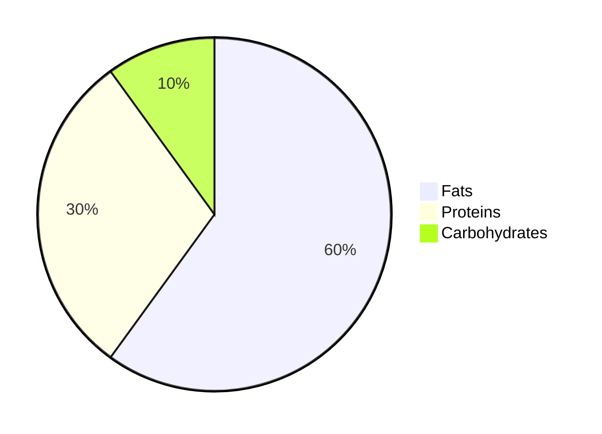
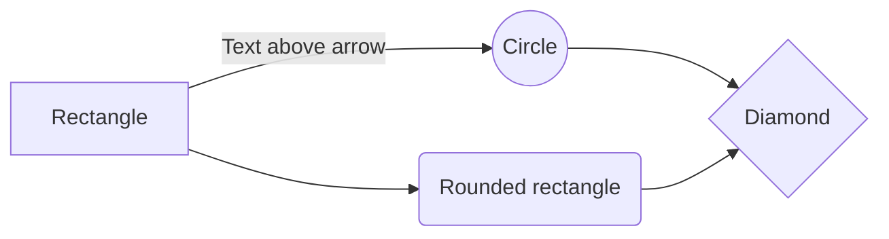

Markdown is a text formatting language. Thanks to it, your notes always look perfectly structured and easy on the eye. As long as you follow a few basic rules, you can produce great-looking documentation without much effort. A big advantage of writing in Markdown is that you do not need any specialised software. A plain text editor is all you need. Yes — even Notepad is enough! 😆

I will show each formatting option as code first, then the result it produces.

## Headings

```markdown
# Heading 1
## Heading 2
### Heading 3
#### Heading 4
##### Heading 5
```

# Heading 1

## Heading 2

### Heading 3

#### Heading 4

##### Heading 5

## Text Styles

> For the examples here I will use the sentence: *The quick brown fox jumps over the lazy dog*. It is a pangram — a sentence that contains every letter of the English alphabet.

```markdown
### Bold

**The quick brown fox jumps over the lazy dog.**

__The quick brown fox jumps over the lazy dog.__

### Italic

*The quick brown fox jumps over the lazy dog.*

_The quick brown fox jumps over the lazy dog._

### Bold and italic

***The quick brown fox jumps over the lazy dog.***

___The quick brown fox jumps over the lazy dog.___
```

### Bold

**The quick brown fox jumps over the lazy dog.**

__The quick brown fox jumps over the lazy dog.__

### Italic

*The quick brown fox jumps over the lazy dog.*

_The quick brown fox jumps over the lazy dog._

### Bold and italic

***The quick brown fox jumps over the lazy dog.***

___The quick brown fox jumps over the lazy dog.___

## Blockquote

```markdown
> The quick brown fox jumps over the lazy dog.
> The quick brown fox jumps over the lazy dog.
>
> The quick brown fox jumps over the lazy dog.
>
> The quick brown fox jumps over the lazy dog.
> The quick brown fox jumps over the lazy dog.
>> The quick brown fox jumps over the lazy dog.
>>> The quick brown fox jumps over the lazy dog.
```

> The quick brown fox jumps over the lazy dog.
> The quick brown fox jumps over the lazy dog.
>
> The quick brown fox jumps over the lazy dog.
>
> The quick brown fox jumps over the lazy dog.
> The quick brown fox jumps over the lazy dog.
>> The quick brown fox jumps over the lazy dog.
>>> The quick brown fox jumps over the lazy dog.

## Strikethrough

```markdown
Strikethrough text

~~The quick brown fox jumps over the lazy dog.~~
```

Strikethrough text

~~The quick brown fox jumps over the lazy dog.~~

## Superscript

```markdown
2 <sup>53-1</sup> and -2 <sup>53-1</sup>
```

2 <sup>53-1</sup> and -2 <sup>53-1</sup>

## Subscript

```markdown
Subscript text

<sub>The quick brown fox jumps over the lazy dog.</sub>
```

Subscript text
<sub>The quick brown fox jumps over the lazy dog.</sub>

## Tables

```markdown
| Default | Left aligned | Centered | Right aligned |
| ------- |:-------------|:--------:|--------------:|
| 9999999999 | 9999999999 | 9999999999 | 9999999999 |
| 999999999  | 999999999  | 999999999  | 999999999  |
| 99999999   | 99999999   | 99999999   | 99999999   |
| 9999999    | 9999999    | 9999999    | 9999999    |
```

| Default | Left aligned | Centered | Right aligned |
| ------- |:-------------|:--------:|--------------:|
| 9999999999 | 9999999999 | 9999999999 | 9999999999 |
| 999999999  | 999999999  | 999999999  | 999999999  |
| 99999999   | 99999999   | 99999999   | 99999999   |
| 9999999    | 9999999    | 9999999    | 9999999    |

## Links

```markdown
[Chatrix.One - Documentation](https://docs.chatrix.one)
```

[Chatrix.One - Documentation](https://docs.chatrix.one)

## Email addresses

```markdown
<justin.tester@nonexistent.mail>
```

<justin.tester@nonexistent.mail>

## Images

### From a URL

```markdown

```


*The image is loaded and displayed from the given URL.*

### Local

```markdown

```


*The image is loaded and displayed from local storage.*

## Lists

```markdown
1. One
2. Two
3. Three
```

1. One
2. Two
3. Three

```markdown
1. First level
     1. Second level
         - Third level
             - Fourth level
2. First level
     1. Second level
3. First level
     1. Second level
```

1. First level
     1. Second level
         - Third level
             - Fourth level
2. First level
     1. Second level
3. First level
     1. Second level

```markdown
* 1
* 2
* 3

+ 1
+ 2
+ 3

- 1
- 2
- 3
```

* 1
* 2
* 3

+ 1
+ 2
+ 3

- 1
- 2
- 3

```markdown
- First level
     - Second level
         - Third level
             - Fourth level
- First level
     - Second level
- First level
     - Second level
```

- First level
  - Second level
    - Third level
      - Fourth level
- First level
  - Second level
- First level
  - Second level

```markdown
- [x] Cherries 1kg
- [ ] Baklava 250g
- [ ] Pay phone bill
```

- [x] Cherries 1kg
- [ ] Baklava 250g
- [ ] Pay phone bill

## Keyboard keys

```markdown
<kbd>Ctrl</kbd> + <kbd>Shift</kbd> + <kbd>P</kbd>
```

<kbd>Ctrl</kbd> + <kbd>Shift</kbd> + <kbd>P</kbd>

```markdown
<kbd> <br> Ctrl + Shift + P <br> </kbd>
```

<kbd> <br> Ctrl + Shift + P <br> </kbd>

## Horizontal lines

```markdown
Option one
___

Option two

* * *

Option three

---
```


*Whichever option you choose, the result is the same.*

## Footnotes

```markdown
Chatrix.One is a server offering communication based on the XMPP[^1] protocol.
The communication is encrypted[^2] using OMEMO[^3].

[^1]: XMPP - Extensible Messaging and Presence Protocol;
[^2]: Also known as encryption;
[^3]: OMEMO is a method of double end-to-end encryption;
```

Chatrix.One is a server offering communication based on the XMPP[^1] protocol. The communication is encrypted[^2] using OMEMO[^3].

[^1]: XMPP - Extensible Messaging and Presence Protocol;
[^2]: Also known as encryption;
[^3]: OMEMO is a method of double end-to-end encryption;

> Wherever you place the footnote description in the editor, it will always be rendered at the very bottom of the document.

## Embedding code


*For correct rendering, the code above is shown as an image.*

```python
# Brute force with a try-except block (Python 3+)
try:
    with open('/path/to/file', 'r') as fh:
        pass
except FileNotFoundError:
    pass

# Leverage the OS package (possible race condition)
import os
exists = os.path.isfile('/path/to/file')

# Wrap the path in an object for enhanced functionality
from pathlib import Path
config = Path('/path/to/file')
if config.is_file():
    pass
```

## Terminal commands

```markdown
`cat /etc/os-release`
```

`cat /etc/os-release`

## Diagrams


*For correct rendering, the code above is shown as an image.*



## Flowchart


*For correct rendering, the code above is shown as an image.*



## Mathematical expressions

```markdown
Inline mathematical expression $x = {-b \pm \sqrt{b^2-4ac} \over 2a}$
```

Inline mathematical expression $x = {-b \pm \sqrt{b^2-4ac} \over 2a}$

```markdown
x = {-b \pm \sqrt{b^2-4ac} \over 2a}
```

$$
x = {-b \pm \sqrt{b^2-4ac} \over 2a}
$$

With this knowledge you can do a lot. Keep in mind that this is far from everything Markdown can do, but for most people it is more than enough to create perfectly organised documentation.