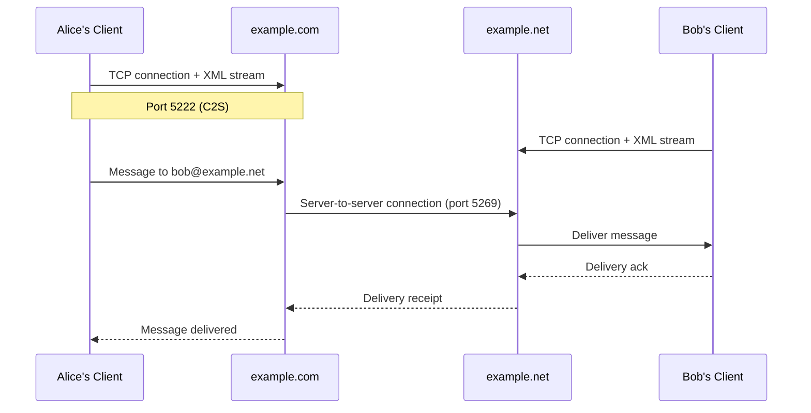
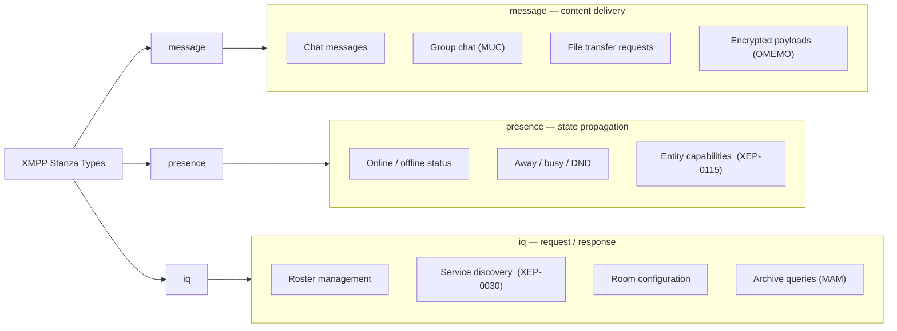
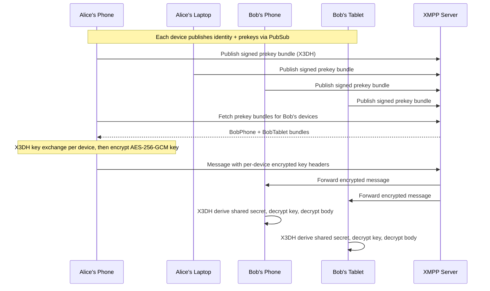

You have probably never heard of XMPP, yet there is a good chance you have indirectly encountered it. Google Talk was built on it. WhatsApp's early infrastructure ran on ejabberd, one of the most widely deployed XMPP servers. Cisco, Nokia, and dozens of enterprise vendors shipped products built entirely on XMPP internals. Countless chat systems, collaboration platforms, and real-time communication tools borrowed directly from its architecture over the last two decades.

> **Note:** This article is a technical deep dive into how XMPP works at the protocol level. If you are looking for a lighter introduction without the XML and RFCs, there is a [non-technical version here](https://blog.chatrix.one/en/posts/xmpp-communication/) that covers the same topic in plain language.

Today, messaging is dominated by walled gardens. A WhatsApp user cannot directly message someone on Signal. A Signal user cannot chat with an iMessage user. A Telegram user lives inside Telegram's ecosystem. Every platform exists as its own island, complete with its own accounts, clients, and rules. Most people accept this arrangement because the applications are polished, convenient, and familiar.

The internet was not supposed to work this way. Email remains interoperable because it is built on open standards. Anyone can run a mail server and communicate with anyone else. The web works because browsers and websites speak common protocols. Messaging could have evolved in the same direction. Instead, most of the industry chose centralization.

Almost.

There is one protocol that stubbornly refused to follow that path. A protocol that has survived the rise and fall of instant messaging networks, social media empires, and countless startup chat applications. That protocol is XMPP. It is decentralized, open, extensible, and older than many of the developers using it today. Most importantly, it still works.

Twenty-five years after its creation, people continue to build on it, extend it, and deploy it. There are currently over 3,000 publicly listed XMPP servers operating worldwide, with estimates suggesting the actual number including private deployments is significantly higher. While newer communication systems come and go, XMPP remains quietly operational, routing billions of XML stanzas daily. To understand why, we need to go back to the beginning.

## The Beginning: Jabber and the Open Internet

The story starts in 1998. At the time, instant messaging was fragmented across several proprietary networks. AOL Instant Messenger dominated with over 50 million users, ICQ had roughly 40 million, Yahoo! Messenger and MSN Messenger were growing rapidly, and each operated as a completely closed ecosystem. If your friends used a different service, you were out of luck. There was no cross-platform messaging, no open API, and no interest from the companies involved in changing that.

Jeremie Miller, a programmer from Iowa, found this situation frustrating. The internet itself was built around open protocols: SMTP for email, DNS for name resolution, HTTP for the web, IRC for group chat. Messaging seemed to be moving in the opposite direction, toward fragmentation and vendor control. His solution was a project called Jabber, with a simple goal: create an open protocol that anyone could implement and anyone could use.

In January 1999, Miller announced the Jabber project publicly. The first server implementation, jabberd, was released as open source software. Over the following years, a community formed around the protocol, producing multiple server implementations, dozens of clients, and a growing library of protocol extensions.

Unlike every major messaging system of the era, Jabber was designed from the start as a federated network. You could run your own server. You could create your own client. You could communicate with users on entirely different servers. No central authority controlled the network. The idea was structurally identical to email, except optimized for real-time communication with sub-second message delivery and persistent connection semantics.

By 2002, the protocol had matured enough that the Jabber Software Foundation submitted it to the Internet Engineering Task Force (IETF), the organization responsible for standardizing internet protocols including TCP, HTTP, SMTP, and DNS. The result was XMPP, the Extensible Messaging and Presence Protocol. In 2004, the IETF published the first formal specifications as RFC 3920 (XMPP Core) and RFC 3921 (Instant Messaging and Presence). Those were later revised and superseded by RFC 6120 (XMPP Core), RFC 6121 (Instant Messaging and Presence), and RFC 7622 (Address Format), which remain the authoritative references today.

## XMPP Is Not an Application

One of the most important things to understand about XMPP is that it is not an app. People often compare it directly to WhatsApp, Signal, Telegram, or Discord, and that comparison is fundamentally wrong. XMPP is a protocol, in the same way that SMTP is a protocol and HTTP is a protocol. A more accurate comparison: SMTP is to Gmail as XMPP is to Conversations. HTTP is to Chrome as XMPP is to Gajim.

The protocol defines how information moves across the network. Applications implement the protocol and provide a user interface. This distinction matters enormously because it changes who controls the system. With a proprietary messaging platform, a single company owns the servers, the protocol, the client applications, and the user accounts. The entire stack is vertically integrated and controlled. With XMPP, these components are fully independent. You can switch clients without changing servers. You can switch servers without changing clients. You can run your own infrastructure and still communicate with the rest of the world. That flexibility is one of the primary reasons XMPP has remained viable for twenty-five years.

## Federation: Email for Real-Time Communication

At its core, XMPP is a federated system. Federation means that independent servers communicate directly with one another using a shared protocol, without requiring a central authority to broker the exchange. Email is the most successful example of federation at scale: over 4 billion email users across hundreds of thousands of independent mail servers all communicate freely because they share the SMTP standard. XMPP follows the same architectural model.

The diagram below shows how two XMPP servers route a message between users on different domains.



When `alice@example.com` sends a message to `bob@example.net`, Alice's server looks up the DNS SRV record for `_xmpp-server._tcp.example.net` to find Bob's server address, opens a TLS-protected TCP connection on port 5269, authenticates using Dialback (XEP-0220) or SASL EXTERNAL with a certificate, and forwards the stanza. No central XMPP authority participates in the exchange. The servers communicate directly, peer to peer.

The benefits of this architecture are significant: no single point of failure, no mandatory vendor lock-in, freedom to host your own infrastructure, interoperability across organizations, and long-term architectural resilience. The tradeoffs are real too. Spam becomes harder to control because there is no central abuse team. Administrators must manage trust relationships with remote domains. Server operators bear full responsibility for security and uptime. These are the same tradeoffs email has navigated for decades, and the XMPP community has developed comparable tooling to manage them.

## Understanding XMPP JIDs and Addresses

Every XMPP user has a Jabber ID, commonly called a JID. The format is defined in RFC 7622 and consists of up to three parts. A bare JID looks identical to an email address: `alice@example.com`. The `alice` portion is called the localpart, and `example.com` is the domainpart. A full JID adds a third component called the resource: `alice@example.com/laptop`.

The resource identifies a specific client session rather than the user in general. A single user can have multiple resources connected simultaneously, each representing a different device or client instance. For example, `alice@example.com/phone`, `alice@example.com/laptop`, and `alice@example.com/tablet` can all be active at the same time. When a message is addressed to the bare JID `alice@example.com`, the server applies a routing algorithm to decide which resource receives it, typically the one with the highest declared priority. When a message targets the full JID `alice@example.com/phone`, it is delivered specifically to that session and no other.

This resource mechanism was XMPP's answer to multi-device messaging in 2004, years before the problem became mainstream. The localpart and domainpart are case-insensitive and must conform to the Nodeprep and Nameprep profiles of the Stringprep specification (RFC 3454). Resources are case-sensitive and subject to the Resourceprep profile. These rules exist to prevent ambiguity and ensure consistent address handling across different server implementations.

## Presence: The Core That Makes XMPP Different

Most people think of messaging as sending text. XMPP was designed around a broader and more technically interesting concept: presence. Presence is not just an online indicator. It is a real-time distributed state propagation system built into the core of the protocol.

Presence answers questions that most protocols treat as secondary concerns: Is this user online? Are they away, busy, or in a meeting? Which device are they using? What capabilities does their current client support? The last question is handled by Entity Capabilities (XEP-0115), which allows clients to advertise a hash of their supported feature list inside every presence stanza. This means any contact who receives your presence update can immediately derive exactly which XEPs your client supports, without issuing a separate discovery query.

When a user connects, their client sends a `<presence/>` stanza, which the server fans out to every authorized contact. Each contact's server then delivers the update to that contact's connected resources. This creates a subscription-based pub/sub graph at the core of every XMPP session. The server maintains a presence graph that is continuously updated as users connect, disconnect, and change status. At scale, a busy ejabberd cluster handling millions of users can process hundreds of thousands of presence stanzas per second. In the late 1990s, building this kind of real-time distributed awareness into a protocol standard was genuinely novel.

## How a Message Travels Across the Network

To understand XMPP at a technical level, it helps to trace the exact sequence of events that occurs when Alice sends a message to Bob on a different server.

1. Alice's client opens a TCP connection to `example.com` on port 5222.
2. The server sends an initial `<stream:stream>` header advertising available features.
3. The client initiates STARTTLS. The server upgrades the connection to TLS 1.2 or 1.3.
4. The XML stream restarts over the encrypted connection.
5. The server advertises SASL mechanisms. Alice authenticates using SCRAM-SHA-256.
6. The stream restarts again. The client sends an IQ bind request to claim a resource.
7. Session establishment completes. Alice's client sends a `<presence/>` stanza.
8. Bob's client completes the same sequence on `example.net`.
9. Alice composes a message. Her client sends a `<message>` stanza addressed to `bob@example.net`.
10. Alice's server parses the stanza, sees the remote domain, and performs a DNS SRV lookup for `_xmpp-server._tcp.example.net`.
11. If no existing S2S connection exists, `example.com` opens a new TLS connection to `example.net` on port 5269 and authenticates the stream.
12. The stanza is forwarded over the S2S connection.
13. `example.net` verifies the stanza, looks up Bob's active resources, and routes the message to the appropriate session.
14. Bob's client receives the stanza.

The full round trip from step 9 to step 14 typically completes in under 100 milliseconds on well-connected servers. Unlike HTTP where each request-response cycle involves connection setup overhead, XMPP connections remain open for the duration of the session. A client connected for hours sends thousands of stanzas over a single TCP connection, with TLS negotiation happening only once at session start.

## XML Streams: The Foundation of XMPP

One reason XMPP feels architecturally unusual to developers familiar with REST or gRPC is its use of persistent XML streams. This choice is often criticized by developers who associate XML with bloated enterprise software, but in XMPP, XML serves a very different purpose than document serialization.

An XMPP session consists of two independent XML streams: one in each direction. Each stream is a single long-lived XML document that begins with a `<stream:stream>` root element and ends with `</stream:stream>` only at disconnection. Between those tags, stanzas flow continuously in real time. Both client-to-server and server-to-server connections follow this model, each maintaining their own pair of streams.

A session opening looks like this:

```xml
<?xml version='1.0'?>
<stream:stream
    from="alice@example.com"
    to="example.com"
    version="1.0"
    xml:lang="en"
    xmlns="jabber:client"
    xmlns:stream="http://etherx.jabber.org/streams">
```

The server responds with its own stream header, then advertises features:

```xml
<stream:features>
  <starttls xmlns="urn:ietf:params:xml:ns:xmpp-tls">
    <required/>
  </starttls>
</stream:features>
```

After TLS negotiation and authentication complete, the stream restarts and further features are advertised, typically resource binding and session management. The `stream:stream` root element is intentionally never closed during normal operation. It remains open as an infinite container for stanzas until either side sends `</stream:stream>` to signal an orderly shutdown.

This design provides several practical advantages. XML namespaces allow different extensions to share the same stream without collisions. New stanza types and child elements can be added without changing the stream framing. The self-describing nature of XML means a stream capture is human-readable and debuggable without a schema. These properties allowed XMPP to absorb decades of protocol evolution without requiring a wire-format redesign.

## The Three Stanzas: The DNA of XMPP

Everything exchanged in an XMPP session is encoded as one of three stanza types. These are not application-level constructs layered on top of a transport. They are the transport itself, defined in the core RFC and processed directly by every XMPP server on the planet.



### message

The `<message>` stanza carries content from one entity to another. It does not require acknowledgment by default, which makes it suitable for fire-and-forget delivery. The `type` attribute controls routing behavior: `chat` for one-to-one conversations, `groupchat` for MUC rooms, `headline` for automated notifications, `normal` for asynchronous messages without a conversational context, and `error` for delivery failure reports.

```xml
<message
    from="alice@example.com/laptop"
    to="bob@example.net"
    type="chat"
    id="msg-001">
  <body>Hello!</body>
  <request xmlns="urn:xmpp:receipts"/>
</message>
```

The `id` attribute is used for delivery receipts (XEP-0184) and message correction (XEP-0308). Extensions attach functionality by adding child elements in their own XML namespaces, without modifying the core stanza structure.

### presence

The `<presence>` stanza communicates availability and state. A bare `<presence/>` with no attributes signals that the user is online and available. The `type` attribute drives the subscription and availability model: `unavailable` signals disconnection, `subscribe` requests presence subscription, `subscribed` grants it, `unsubscribe` and `unsubscribed` manage removal. Status and priority child elements allow fine-grained control:

```xml
<presence>
  <show>away</show>
  <status>In a meeting until 3pm</status>
  <priority>10</priority>
  <c xmlns="http://jabber.org/protocol/caps"
     hash="sha-1"
     node="https://gajim.org"
     ver="QgayPKawpkPSDYmwT/WM94uAlu0="/>
</presence>
```

The `<c/>` element is the Entity Capabilities hash from XEP-0115. Any client receiving this presence stanza can compute the SHA-1 hash of the sender's feature list and compare it against a local cache, avoiding a full service discovery round-trip.

### iq

IQ stands for Info/Query. These stanzas implement a synchronous request-response pattern, functioning as lightweight remote procedure calls over the XML stream. Every IQ request must receive exactly one IQ response. The `type` attribute has four values: `get` (request), `set` (write), `result` (success response), and `error` (failure response).

A roster fetch looks like this:

```xml
<!-- Request -->
<iq type="get" id="roster1" from="alice@example.com/laptop">
  <query xmlns="jabber:iq:roster"/>
</iq>

<!-- Response -->
<iq type="result" id="roster1" to="alice@example.com/laptop">
  <query xmlns="jabber:iq:roster" ver="ver14">
    <item jid="bob@example.net" name="Bob" subscription="both">
      <group>Friends</group>
    </item>
  </query>
</iq>
```

The `id` attribute correlates requests and responses when multiple IQ exchanges are in flight simultaneously, which is common during session initialization when the client issues service discovery, roster, and bookmarks queries in parallel.

## The Power of XEPs: How XMPP Evolves Without Breaking Itself

Most protocols become obsolete because they cannot adapt cleanly. The internet is littered with technologies that solved a problem well but became trapped by their own design as requirements shifted. XMPP avoided this fate through a deliberate architectural principle: keep the core protocol small and stable, and move all new functionality into independently versioned extensions.

These extensions are called XMPP Extension Protocols, or XEPs. They are published, maintained, and advanced through a standards process run by the XMPP Standards Foundation (XSF), a non-profit organization founded in 2001. As of 2026, there are over 450 published XEPs covering topics ranging from basic file transfer to IoT sensor telemetry, social networking, real-time gaming, and enterprise workflow automation. Each XEP goes through a lifecycle: Experimental, Proposed, Draft, Final, and potentially Deprecated or Obsolete. This staged process means implementations have stable targets to build against, and the community can deprecate outdated extensions without breaking the core.

Think of the RFCs as the kernel. XEPs are the userspace. The kernel defines how stanzas are routed, streams are opened, and authentication works. Everything else lives in extensions. Not every server or client implements every XEP, and that is by design. A minimal embedded IoT client might implement only the core RFC plus XEP-0199 (ping) and XEP-0060 (PubSub). A full-featured desktop client like Gajim implements well over 50 XEPs. Both are valid XMPP implementations. Both interoperate on the stanza routing level regardless of their respective feature sets.

## Service Discovery: The Extension That Makes Extensions Work

If every client had to hardcode which features each server supports, the XEP ecosystem would have collapsed under its own weight years ago. The mechanism that prevents this is XEP-0030, Service Discovery, universally referred to as Disco.

Disco defines two sub-queries. The `disco#info` query asks an entity what features and identities it supports. The `disco#items` query asks what child nodes or services it exposes. A client connecting to a new server for the first time issues a `disco#info` query to the server's domain JID:

```xml
<iq type="get" to="example.com" id="disco1">
  <query xmlns="http://jabber.org/protocol/disco#info"/>
</iq>
```

The server responds with a list of feature strings, each corresponding to a namespace defined in a XEP:

```xml
<iq type="result" from="example.com" id="disco1">
  <query xmlns="http://jabber.org/protocol/disco#info">
    <identity category="server" type="im" name="ejabberd"/>
    <feature var="urn:xmpp:mam:2"/>
    <feature var="urn:xmpp:push:0"/>
    <feature var="vcard-temp"/>
    <feature var="http://jabber.org/protocol/disco#info"/>
    <feature var="urn:xmpp:carbons:2"/>
  </query>
</iq>
```

The client now knows exactly which XEPs are available and can enable or disable features accordingly. The `disco#items` query is used to enumerate child services: a server might expose a conference component at `conference.example.com`, a pubsub service at `pubsub.example.com`, and a file upload service at `upload.example.com`. Disco is the directory that ties all of these together. Without it, extension negotiation would require out-of-band coordination between administrators and developers. With it, clients adapt automatically at runtime.

## The Roster: More Than a Contact List

Every messaging platform needs contact management. In XMPP, this is called the roster, and it is more sophisticated than a simple address book. The roster is stored on the server and synchronized to all connected clients via IQ stanzas. It contains each contact's JID, a human-readable name, an optional group, and crucially, a subscription state.

The subscription state tracks the mutual presence-sharing relationship between two users. There are four possible values: `none` (no presence sharing), `from` (the contact shares presence with you), `to` (you share presence with the contact), and `both` (mutual presence sharing). This model gives users explicit control over who can see their online status, unlike most modern messaging apps where presence sharing is binary and often automatic.

When Alice adds Bob as a contact, she sends a `<presence type="subscribe"/>` stanza to his JID. Bob receives a subscription request and can either approve it with `<presence type="subscribed"/>` or decline with `<presence type="unsubscribed"/>`. Only after Bob approves does Alice's server begin delivering his presence updates. This formal subscription model predates and anticipates the concept of follow/friend requests that became standard in social networks years later.

## Multi-User Chat: Group Messaging Before Group Messaging Was Cool

XEP-0045, Multi-User Chat (MUC), is one of the oldest and most universally implemented XMPP extensions. It was published in 2002, three years before Slack existed as a concept and a decade before enterprise group messaging became a mainstream category. A MUC room is a persistent, server-hosted chat room with a full access control model.

Each room has a bare JID identifying the room service and room name: `developers@conference.example.org`. Users join by sending a directed presence to a full JID that includes their chosen nickname: `developers@conference.example.org/alice`. The room then reflects messages to all occupants using the `groupchat` message type.

MUC rooms support a four-tier role and affiliation system. Affiliations are persistent: owner (full administrative control), admin (can ban and kick), member (allowed in members-only rooms), and outcast (banned). Roles are session-scoped: moderator, participant, and visitor. This granular permission system allowed XMPP to host structured communities with proper governance years before Discord and Slack popularized the concept. The protocol continues to evolve in this area; XEP-0402 provides improved room bookmark management with server-side synchronization, and MUC Sub (XEP-0369) introduces subscription-based group messaging as an alternative to the traditional occupant model.

## PubSub: The Most Underrated Part of XMPP

Most people associate XMPP with direct messaging. XEP-0060, Publish-Subscribe (PubSub), reveals a different dimension of the protocol entirely. PubSub transforms XMPP from a point-to-point messaging system into a real-time event distribution platform with a formal subscription model.

The architecture is straightforward. A PubSub service hosts a tree of nodes. Publishers push items to nodes. Subscribers receive those items automatically without polling. A publisher has no knowledge of who is subscribed: it simply writes to the node and the service handles fan-out. This decoupling is architecturally identical to the broker model used by Apache Kafka, MQTT, and AMQP, except that XMPP PubSub delivers events over the same authenticated, federated stream that carries chat messages.

Practical deployments have used XMPP PubSub for SCADA telemetry (the XMPP-IoT initiative), location tracking in fleet management systems, social activity feeds (the original design of the now-defunct Buddycloud social network was built entirely on XMPP PubSub), operational monitoring pipelines, and software-defined networking control planes. The XSF published XEP-0235 and related IoT extensions precisely because XMPP PubSub is a natural fit for device-to-cloud telemetry at scale: authenticated, federated, real-time, and standards-based.

## Jingle: Voice, Video, and File Transfers

XEP-0166, Jingle, is XMPP's answer to the problem of establishing real-time media sessions between clients. It is not a media transport protocol. It is a signaling framework: its job is to negotiate the parameters of a direct connection between two endpoints, after which media flows peer-to-peer outside the XMPP stream entirely.

Jingle uses ICE (Interactive Connectivity Establishment, RFC 8445) for NAT traversal, which is exactly the same mechanism that WebRTC uses. This is not a coincidence: the authors of the WebRTC specification drew directly on the experience of Jingle and related IETF work. ICE works by gathering address candidates from multiple sources: the local network interface, a STUN server, and optionally a TURN relay. Candidates are exchanged via XMPP signaling stanzas, and ICE performs connectivity checks to find a working path. In practice, direct peer-to-peer connections succeed in roughly 80-85% of cases on typical networks. The remaining cases fall back to TURN relay.

The media itself is carried over RTP (RFC 3550) with codec negotiation handled via SDP offer/answer embedded in Jingle stanzas (XEP-0167 for audio, XEP-0180 for video). The result is a complete, standards-based, peer-to-peer multimedia signaling system that predated WebRTC by several years and influenced its design.

## Modern Messaging Requires Synchronization

In 2004, most users had one device. In 2026, the average smartphone owner also owns a laptop, and many have a tablet and a workstation. Every message sent needs to appear on all of them. XMPP addresses multi-device synchronization through two complementary extensions that work together.

### Message Archive Management

XEP-0313, Message Archive Management (MAM), defines a server-side message store with a structured query interface. When MAM is enabled, the server archives every stanza passing through it. A client that was offline for six hours, or a newly installed client on a fresh device, issues a MAM query with a timestamp filter to retrieve everything it missed:

```xml
<iq type="set" id="mam1">
  <query xmlns="urn:xmpp:mam:2" queryid="q1">
    <x xmlns="jabber:x:data" type="submit">
      <field var="FORM_TYPE" type="hidden">
        <value>urn:xmpp:mam:2</value>
      </field>
      <field var="start">
        <value>2026-06-12T08:00:00Z</value>
      </field>
    </x>
  </query>
</iq>
```

The server streams archived stanzas back as forwarded messages, each wrapped with its original timestamp. MAM supports full-text search on servers that implement it, RSM (Result Set Management, XEP-0059) for paginated retrieval, and filtering by JID or date range. Without MAM, every device maintains an isolated local history with no way to synchronize. With MAM, conversation history becomes a server resource that any authenticated client can query.

### Message Carbons

XEP-0280, Message Carbons, handles the real-time half of the synchronization problem. When a client opts in by sending an IQ enable stanza, the server copies every outgoing and incoming message for that account to all other connected resources simultaneously. If Alice sends a message from her phone, her laptop receives a carbon copy within milliseconds. This keeps all active sessions consistent in real time without requiring clients to poll or query MAM for recent messages. MAM and Carbons work in tandem: Carbons handles live sync for connected devices, MAM handles catch-up for offline or newly connected ones.

## Stream Management: Surviving Bad Networks

Mobile networks drop connections constantly. A user moving between Wi-Fi and cellular, entering an elevator, or simply locking their screen can cause the underlying TCP connection to terminate without either side being immediately aware. Without a recovery mechanism, the result is silent message loss and desynchronized state.

XEP-0198, Stream Management, solves this with a lightweight acknowledgment and resumption protocol layered on top of the XML stream. After enabling Stream Management, both client and server maintain a counter of stanzas received. The client periodically sends `<a h="N"/>` stanzas acknowledging receipt of N stanzas from the server, and the server does the same in the other direction. At any point, either side can send `<r/>` to request an immediate acknowledgment.

When a connection drops, the client reconnects and sends a `<resume/>` stanza containing the last acknowledgment counter and a session token issued during the original session establishment. The server checks its outbound queue, identifies which stanzas were not acknowledged, and retransmits only those. The session resumes exactly where it left off, with guaranteed delivery semantics equivalent to TCP but operating at the XMPP stanza level rather than the byte level. In testing on high-latency mobile networks, Stream Management reduces message loss rates to near zero even under poor conditions. It also reduces reconnection overhead significantly: a resumed session avoids full TLS negotiation and SASL authentication, cutting reconnection time from several seconds to under 200 milliseconds on typical mobile connections.

## Push Notifications and Mobile Reality

One valid criticism of XMPP on mobile platforms has historically been battery consumption. Maintaining a persistent TCP connection on a smartphone requires keeping the radio active, which drains the battery. iOS and Android both have background process restrictions that make long-lived connections difficult to maintain.

Modern XMPP deployments address this through XEP-0357, Push Notifications. The mechanism works as follows: the mobile client registers a push endpoint with the XMPP server (typically an Apple APNs or Google FCM token routed through an intermediary app server). When a message arrives for the user and no active XMPP connection exists, the server sends a push notification through the platform's native push infrastructure to wake the client. The client then re-establishes its XMPP connection, retrieves the message via MAM or Carbons, and presents it to the user.

This approach adds latency of roughly one to three seconds compared to a persistent connection, but reduces background battery consumption to levels comparable to email clients. Applications like Conversations on Android and Monal on iOS have validated this approach in production, demonstrating that XMPP battery usage on modern smartphones is acceptable for typical messaging workloads. The claim that XMPP is inherently battery-inefficient on mobile reflects the state of the ecosystem circa 2012, not 2026.

## Security: The Foundation Matters

Security in a communication protocol is not a single feature. It is a stack of mechanisms addressing different threat models at different layers. XMPP's security architecture addresses transport confidentiality, authentication integrity, end-to-end encryption, and forward secrecy independently, which allows each layer to be evaluated and upgraded without disrupting the others.

## TLS: Protecting Data in Transit

Every production XMPP deployment encrypts transport using TLS. Client-to-server connections on port 5222 begin unencrypted and upgrade via STARTTLS (RFC 3207 adapted for XMPP in RFC 6120). Server-to-server connections on port 5269 follow the same pattern. There is also a direct TLS port (5223 for C2S) where the TLS handshake happens immediately on connection, which avoids the STARTTLS negotiation round-trip.

Modern XMPP servers require TLS 1.2 as a minimum, with TLS 1.3 preferred. The XMPP Standards Foundation's Security Considerations document recommends cipher suite configurations that prioritize AEAD ciphers (AES-GCM, ChaCha20-Poly1305) and forward-secret key exchange (ECDHE). Certificate validation is mandatory. The `xmpp.net` compliance checker publicly tests servers and scores them on TLS configuration quality, and the majority of well-maintained public servers achieve A or A+ ratings.

## SASL: Authentication Done Properly

Authentication in XMPP is handled through SASL, the Simple Authentication and Security Layer (RFC 4422). SASL defines an abstraction layer that separates the authentication mechanism from the protocol that uses it, allowing XMPP to support multiple authentication methods without embedding any specific credential exchange into the core spec.

The mechanisms available in a typical deployment are: SCRAM-SHA-256 and SCRAM-SHA-1 (Salted Challenge Response Authentication Mechanism, RFC 5802), which prove knowledge of a password using a cryptographic challenge-response exchange without transmitting the password or a reversible hash; PLAIN, which transmits the password in base64 and is only acceptable over a TLS-protected connection; and EXTERNAL, which uses a client certificate for authentication and is the standard approach for server-to-server authentication when mutual TLS is configured. SCRAM-SHA-256 is the current recommended mechanism for password-based client authentication. It provides mutual authentication (the client also verifies the server's identity during the exchange), which protects against credential theft in the event of DNS spoofing or certificate misissuance.

## OMEMO: Modern End-to-End Encryption

Transport encryption protects data in transit but does not protect messages from the server operator or anyone with access to the server. End-to-end encryption ensures that ciphertext is the only thing the server ever sees. The current standard for E2EE in XMPP is OMEMO, defined in XEP-0384.

OMEMO is built on two cryptographic primitives from the Signal Protocol. X3DH (Extended Triple Diffie-Hellman) is used for initial key establishment: each device publishes a set of public keys to the server (an identity key, a signed prekey, and a batch of one-time prekeys). When a sender wants to initiate an encrypted session with a recipient's device, it fetches the recipient's public keys and performs an X3DH exchange to derive a shared secret without any interaction. The Double Ratchet Algorithm then manages the ongoing session. The Double Ratchet maintains two ratchets: a Diffie-Hellman ratchet that generates new key material periodically, and a hash ratchet that derives per-message keys. The result is forward secrecy (compromise of current keys does not expose past messages) and break-in recovery (compromise of a key does not expose future messages after the next DH ratchet step).

OMEMO handles multiple devices natively by encrypting a separate copy of the symmetric message key for each of the recipient's devices, plus each of the sender's own devices for Carbons compatibility. The actual message content is encrypted once with AES-256-GCM. Only the 32-byte AES key is encrypted per-device with the X3DH-derived secret. This means adding more devices has a linear cost in key operations but negligible cost in ciphertext size.



When OMEMO is active, the XMPP server sees only the sender JID, recipient JID, timestamp, and an opaque encrypted blob. Message content, file attachments, and reactions are all indistinguishable ciphertext from the server's perspective.

## Before OMEMO: A Short History of XMPP Encryption

End-to-end encryption in XMPP did not begin with OMEMO. The ecosystem went through three distinct approaches over two decades, each one solving the problems left by its predecessor.

The first was OpenPGP, specified in XEP-0027. It worked by signing and encrypting message bodies using standard PGP keys, which users exchanged and managed manually. For technically sophisticated users already embedded in the PGP ecosystem, this was a natural fit. The problems were significant though: no forward secrecy (compromising a long-term private key exposed every past message encrypted to it), no multi-device support, complex key management, and a dependency on a web of trust model that most users found impractical. XEP-0027 is now officially deprecated. Its successor, XEP-0373 and XEP-0374 (collectively called OpenPGP for XMPP, or OX), modernizes the approach with better key handling and supports encrypting not just message bodies but also presence stanzas and PubSub payloads, which OMEMO does not cover. OX remains technically active and has a niche use case in automated systems and server-to-server encryption scenarios, but it never gained meaningful adoption in consumer clients.

The second approach was OTR, Off-the-Record Messaging, published in the 2004 paper "Off-the-Record Communication, or, Why Not To Use PGP" by Borisov, Goldberg, and Brewer. The title was a direct reference to OpenPGP's shortcomings. OTR introduced two ideas that were genuinely novel at the time: forward secrecy through ephemeral Diffie-Hellman key exchange (each session generated a fresh DH key pair, so compromising long-term keys did not expose past sessions), and cryptographic deniability through MAC key publishing (at session end, OTR published the MAC keys used during the session, meaning anyone could have forged the message transcripts, making them inadmissible as cryptographic proof of authorship).

OTR's fundamental limitation was its assumption of a single active session between two parties. The protocol's DH ratchet was designed for two endpoints synchronizing over a single connection. Adding a second device meant running a completely separate OTR session with incompatible state. A message sent from Alice's laptop would be unreadable on Alice's phone because the phone had never participated in that OTR session. As multi-device usage became the norm, this limitation made OTR increasingly impractical.

OMEMO replaced both by making multi-device E2EE a first-class design requirement from the start, combining the forward secrecy that OTR introduced with the key distribution model needed to support multiple simultaneous device sessions.

## The Metadata Problem

End-to-end encryption solves the content confidentiality problem. It does not solve metadata. Even with OMEMO active, a server operator can observe which JIDs are communicating, at what times, at what frequency, from which IP addresses, and with which remote domains. In a legal context, metadata alone can be highly sensitive: knowing that a journalist's JID communicated with a specific source's JID on specific dates may be as revealing as the message content itself.

This is not a weakness unique to XMPP. Signal collects phone numbers, registration timestamps, and the date of last connection. WhatsApp shares metadata with Meta. Email servers log sender, recipient, timestamps, and IP addresses for every message. The fundamental issue is that routing requires addressing information, and addressing information is metadata. Research into metadata-private messaging (Tor, mix networks, Private Information Retrieval) shows that true metadata privacy comes at significant latency and bandwidth cost, which makes it impractical for real-time messaging at scale. Proposals like XMPP over Tor are technically possible but remain niche.

## Security Is Not Automatic

A protocol can specify perfect security semantics, and a poorly administered deployment can still be insecure. This is true of every protocol. An XMPP server running an outdated version with unpatched CVEs, using a self-signed certificate that clients accept without validation, with accounts protected by weak passwords and no rate limiting on authentication attempts, is not a secure system regardless of what the RFC says.

The XMPP community addresses this partly through the `xmpp.net` compliance checker and the XSF Security Considerations document, and partly through tools like Certbot integration guidance and fail2ban configurations that server administrators can apply. The protocol provides the right primitives. Deployment quality determines whether those primitives are actually protecting anyone.

## The Compliance Problem

Because XMPP is a protocol with hundreds of optional extensions, a client implementing XEPs from 2008 and a server implementing XEPs from 2020 can fail to interoperate on features that both ostensibly support. The XMPP Standards Foundation addresses this through annual Compliance Suites, currently defined in XEP-0459.

The 2024 Compliance Suite defines three tiers: Core (the minimum viable XMPP implementation covering basic messaging, TLS, SASL, service discovery, and entity capabilities), Advanced (adding MAM, Carbons, Stream Management, push notifications, HTTP file upload, and OMEMO), and a work-in-progress A/V tier covering Jingle voice and video. A client or server can claim compliance with a specific tier, and users can use those claims to assess whether two implementations will interoperate on the features they care about. The compliance suite does not eliminate all interoperability friction, but it significantly narrows the surface area of incompatibility for mainstream use cases.

## A Protocol That Never Stopped Evolving

A common misconception is that XMPP is a 2004 protocol running unchanged in 2026. The core wire format and stanza model are indeed stable, by design. The XEP ecosystem is not. In 2023 alone, the XSF published or advanced over 30 XEPs. Active work in 2025 and 2026 includes MLS (Messaging Layer Security, RFC 9420) integration for XMPP group chats, improvements to the Jingle A/V stack to align more closely with current WebRTC practices, refined mobile optimization profiles, and ongoing work on reducing metadata exposure.

The stability of the core and the activity of the extensions layer are complementary rather than contradictory. A client written in 2010 can still connect to a modern ejabberd server and exchange basic messages. A client written in 2025 implementing the full compliance suite can do encrypted group chats, synchronized message history, push notifications, and peer-to-peer voice calls. The protocol accommodates both simultaneously.

## The Ecosystem: Servers, Clients, and the People Keeping XMPP Alive

Protocols do not survive on technical merit alone. They survive because people build software, run servers, write documentation, and keep contributing. XMPP has maintained a functional ecosystem for over two decades, which is rare for any open standard.

## The Major Servers

There is no single official XMPP server implementation, and that is a strength. Different implementations reflect different design priorities, and operators choose based on their requirements.

### ejabberd

ejabberd is the most widely deployed production XMPP server. Originally released in 2002 by Alexey Shchepin and written in Erlang/OTP, it was designed explicitly for the fault-tolerance and concurrency requirements of telecommunications systems. Erlang's actor model maps naturally onto XMPP: each connected user session is a lightweight Erlang process, and the OTP supervision tree ensures that a crashed session never takes down the server. ejabberd clusters can scale horizontally across multiple nodes using Mnesia or an external database backend. Published benchmarks from ProcessOne (the company behind ejabberd) have demonstrated handling of over two million concurrent connections on a single well-tuned node, and clustered deployments at larger scale. WhatsApp ran a heavily modified fork of ejabberd before rewriting their messaging infrastructure in Erlang from scratch. The software is mature, actively maintained, and the dominant choice for high-traffic deployments.

### Prosody

Prosody, written in Lua, targets the opposite end of the scale. A minimal Prosody installation can run comfortably on a server with 512 MB of RAM and handles hundreds of concurrent users without configuration tuning. Its module system is clean and well-documented, making it straightforward to add or remove functionality. Prosody is the most common recommendation for personal or small organizational deployments and the most popular starting point for administrators new to XMPP self-hosting.

### Openfire

Openfire is a Java-based server from Ignite Realtime, focused on enterprise deployments with administrative UI. Its web-based management console makes it approachable for organizations that need centralized control without deep command-line experience. It has a large plugin ecosystem and remains popular in educational institutions and businesses.

### MongooseIM

MongooseIM, maintained by Erlang Solutions, shares architectural roots with ejabberd but has diverged significantly in its focus on mobile-optimized, carrier-grade infrastructure. It includes built-in support for metrics, tracing, and horizontal scaling patterns suited to telco and enterprise deployments at very large scale.

## The Client Ecosystem

The separation between protocol and application means users can choose their client independently from their server. The range of available clients reflects the diversity of the XMPP ecosystem across every major platform.

### Gajim

Gajim is the most feature-complete desktop client available, supporting the full XEP-0459 compliance suite including OMEMO, MAM, Carbons, MUC, and Jingle A/V. It runs on Linux, Windows, and macOS and is the reference client for users who want access to the full protocol surface. For administrators and power users who want to inspect stanzas, test server features, or manage multiple accounts with fine-grained control, Gajim is typically the first recommendation.

### Conversations

Conversations on Android is widely regarded as the best mobile XMPP client and demonstrates that an open protocol client can match the user experience of commercial messaging apps. It handles OMEMO negotiation automatically, supports HTTP file upload, push notifications, and MAM out of the box, and has been the primary driver of mobile usability improvements in the XMPP ecosystem over the last decade.

### Dino

Dino is the cleanest desktop option for Linux users who find Gajim's feature density overwhelming. Written in Vala and built on GTK4, it follows GNOME design principles and integrates naturally into modern Linux desktops. It supports OMEMO, MAM, Carbons, MUC, and Jingle A/V while keeping the interface uncluttered. For users who want a modern messaging experience without exposing protocol internals, Dino strikes the right balance.

### Profanity

Profanity occupies a different corner of the ecosystem entirely. It is a terminal-based XMPP client inspired by irssi, designed for users who live in the command line. Despite its minimal interface, it supports OMEMO encryption, MUC, MAM, and a plugin system written in Python, Lua, Ruby, or C. For server administrators and developers who spend most of their time in SSH sessions, Profanity means never having to leave the terminal to send an encrypted message.

### Converse.js

Converse.js is a fully featured XMPP client that runs entirely in the browser. It is written in JavaScript and can be embedded directly into any web page, which makes it the standard choice for organizations that want to offer XMPP access without requiring users to install anything. It supports OMEMO, MUC, MAM, and Carbons, and can connect to any compliant XMPP server via WebSocket or BOSH. Many self-hosted XMPP deployments use Converse.js as a lightweight web interface alongside native desktop and mobile clients.

### Monal

Monal brings a well-maintained XMPP client to iOS and macOS with full OMEMO support and modern XEP coverage. It has been the primary vehicle for making XMPP accessible to Apple platform users and has improved significantly in recent years in terms of reliability and feature parity with Android counterparts.

### Quicksy

Quicksy addresses XMPP's onboarding friction by using phone-number-based registration and contact discovery while remaining fully compatible with the broader XMPP federation. It is built on the same codebase as Conversations and targets users who want the benefits of a federated open protocol without the account setup complexity that has historically discouraged non-technical users.

### Fluux Messenger

Fluux Messenger is the newest addition to the XMPP client landscape and one of the most interesting recent developments in the ecosystem. It was started in December 2025 by Mickaël Rémond, founder and CEO of ProcessOne, the company behind ejabberd, during a Christmas holiday coding session after his preferred client broke on the branch he was using. What began as a personal weekend project became a full company effort by January 2026 when his team saw the result.

Built with TypeScript, React, and Tauri, Fluux Messenger runs as a native desktop application on Windows, macOS, and Linux, and also works as a web app. The current release implements over 40 XEPs including MAM, MUC with mentions and bookmarks, HTTP file upload, Message Carbons, and reactions. It ships with a built-in XMPP console for developers, local message caching via IndexedDB with automatic sync on reconnect, light and dark themes, and support for 8 languages.

What makes it architecturally interesting is the Fluux SDK underneath. Rather than exposing raw XML stanzas to the UI layer, the SDK provides a typed TypeScript API with reactive state management. The client signals intent to the SDK (for example, that the user has become inactive) and the SDK handles the protocol details. This three-tier design (server, headless SDK, UI) reflects the same engineering philosophy ProcessOne applied to ejabberd on the server side.

Fluux Messenger is open source under AGPL-3.0 and connects to any standard XMPP server. The roadmap includes mobile support via PWA and eventually native apps for Android and iOS. For a project that started as a holiday experiment, it has moved fast. Given that ProcessOne has been the backbone of XMPP server infrastructure for over two decades, having them now seriously invest in the client side is a meaningful signal for the ecosystem.

## Federation in Practice

Federation distributes authority rather than centralizing it, which is both its core value and its operational complexity. Every federated network faces the same challenges: spam, abuse, harassment, resource exhaustion, and moderation disputes without a central authority to adjudicate them. Email has dealt with this for decades through blocklists, reputation systems, SPF, DKIM, and DMARC. The XMPP community has developed analogous tooling: domain blocklists, rate limiting at the S2S layer, and shared abuse reporting. None of it is as mature as the email anti-spam ecosystem, partly because the XMPP network is much smaller and spam is proportionally less prevalent.

Server operators make their own policy decisions about which remote domains to federate with. Some run fully open federation. Others maintain allowlists or use community blocklists. There is no universal right answer because federation, by definition, means no universal authority.

## Why Google Left Federation

Google Talk launched in August 2005 as the first major consumer application built on XMPP, and for a time it supported open federation. A Gmail user could message a non-Google XMPP user on any compliant server. This was the closest XMPP ever came to mainstream adoption: hundreds of millions of Gmail users were technically part of the federated XMPP network.

Google began restricting and degrading federation support around 2012-2013 as Google Talk transitioned toward Hangouts. By 2015, federation was effectively non-functional. The publicly stated reasons involved spam and abuse, but product strategy clearly played a role: Hangouts was being integrated into Google's broader ecosystem, and open federation was incompatible with that direction. The lesson for open protocol advocates was harsh but important: technical architecture does not override business incentives. A company can adopt an open standard for its infrastructure advantages and abandon it when those advantages no longer outweigh the costs of openness.

## WhatsApp and XMPP: A Complicated Relationship

WhatsApp's infrastructure history is a useful illustration of how a company can build on XMPP without remaining interoperable with it. WhatsApp's original backend was ejabberd, a practical choice given ejabberd's proven ability to handle very high message throughput on modest hardware. The WhatsApp engineering team published detailed post-mortems describing how they tuned ejabberd to handle their growth, including a significant Erlang rewrite to replace ejabberd's internal routing with custom code optimized for their specific patterns.

Over time, WhatsApp's XMPP diverged completely from the standard. They added proprietary message types, replaced the standard address format with phone numbers, removed federation entirely, and built a closed ecosystem on top of what was once an open protocol substrate. Modern WhatsApp speaks a protocol that shares historical roots with XMPP but is not interoperable with any standard XMPP server or client. This pattern, using open standards as a foundation and then building a proprietary moat on top, is common enough that it has a name in open source circles: embrace, extend, and eventually close.

## XMPP vs Matrix

Matrix is the most direct contemporary alternative to XMPP for federated messaging, and the comparison is worth examining carefully. Both support federation, end-to-end encryption, and open standards. The architectural differences are significant.

XMPP is a stateless message routing protocol. An XMPP server's job is to receive stanzas and forward them to the appropriate destination. Message history is stored optionally via MAM. A server can be replaced or fail without loss of in-flight messages because the state lives in the clients and in the MAM archive.

Matrix is a distributed state synchronization protocol. Every Matrix homeserver stores a complete copy of the room state for every room it participates in. This means Matrix rooms are highly resilient: as long as one participating homeserver is online, the room history is preserved. It also means Matrix homeservers consume significantly more storage and compute than XMPP servers handling equivalent traffic. Published figures from matrix.org suggest that a Matrix homeserver serving a few thousand users typically requires 10-50 GB of database storage and 2-4 GB of RAM. A Prosody installation serving the same number of users runs comfortably in under 1 GB of RAM with a few GB of MAM storage.

XMPP's advantages are lower operational overhead, more mature server software, a simpler mental model for administrators, and a more flexible extension mechanism. Matrix's advantages are stronger room persistence guarantees, better out-of-the-box experience for new users, more polished collaboration tooling in Element, and significant institutional adoption in European public sector organizations. The French government's decision to standardize on Matrix for inter-ministerial communications is frequently cited as a signal of Matrix's momentum. Both ecosystems continue to develop. The choice depends on whether you prioritize operational simplicity and protocol flexibility (XMPP) or collaborative features and room persistence guarantees (Matrix).

## Is XMPP Dead?

The "XMPP is dead" narrative resurfaces periodically, usually triggered by a high-profile company abandoning the protocol or by a comparison with faster-growing alternatives. The argument relies on conflating consumer mindshare with technical viability. By the consumer mindshare metric, XMPP has never been dominant. By the technical viability metric, it remains fully operational.

As of 2026, the XMPP network includes over 3,000 publicly listed servers, active development on all major server implementations (ejabberd, Prosody, Openfire, MongooseIM), multiple well-maintained clients across all major platforms, an active XSF standards process with dozens of XEPs in active development, and significant deployments in enterprise, government, and embedded systems. The protocol has outlasted every major proprietary messaging network that existed when it was created: AIM shut down in 2017, ICQ was discontinued in 2024, MSN Messenger ended in 2013, Yahoo! Messenger in 2018. XMPP is still running. That is not the profile of a dead protocol.

## The Real Challenge: User Experience

The genuine challenge facing XMPP is not technical maturity. It is the onboarding experience compared to centralized alternatives. Signing up for WhatsApp takes thirty seconds: install the app, enter your phone number, verify with an SMS code. You are done. Your contacts who also use WhatsApp appear automatically.

Setting up an XMPP account has historically required choosing a server, understanding what a JID is, finding contacts who also use XMPP, and potentially configuring OMEMO manually. Each of these steps has a meaningful drop-off rate with non-technical users. Projects like Quicksy address the contact discovery problem by using phone numbers. Automatic OMEMO negotiation in modern clients like Conversations has eliminated most of the encryption configuration burden. Managed XMPP hosting providers reduce the server selection problem. But the gap with the experience of centralized apps remains real.

The irony is that the same properties that make XMPP technically superior for privacy and longevity (decentralization, user control, federation) are precisely what makes onboarding more complex. Closing that gap without sacrificing the protocol's architectural principles is the core unsolved problem.

## Conclusion: The Protocol That Refused to Die

XMPP occupies a strange position in the history of the internet. It is old enough to be considered legacy infrastructure and modern enough to be actively developed. It has been declared obsolete repeatedly and continues to evolve. It has never dominated the consumer messaging market and has outlasted every competitor that existed at its creation.

The protocol's greatest achievement is not technical elegance, though there is plenty of that. Its greatest achievement is demonstrating, for twenty-five consecutive years, that open, federated, real-time communication is operationally viable at scale. Not in a research paper. Not as a startup pitch deck. As running software on thousands of servers processing billions of stanzas.

Will XMPP replace WhatsApp, Signal, Telegram, or iMessage? No. Network effects are real, and convenience usually wins in consumer markets. But that is the wrong question. Email never replaced social media. DNS never became fashionable. TCP never became a household name. All three remain essential infrastructure for the internet. XMPP occupies a similar role: quietly operational, depended upon by those who understand what it provides, ignored by everyone else.

As long as there are people who believe communication infrastructure should be open, federated, and under the control of its participants, there will be XMPP servers somewhere on the internet exchanging stanzas.

And that is why this protocol refuses to die.
